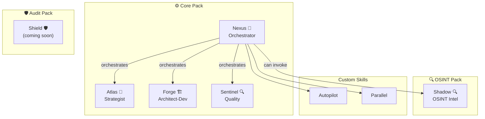

# 🚀 BMAD+ — Augmented AI-Driven Development Framework

[](CHANGELOG.md)
[](https://github.com/bmad-code-org/BMAD-METHOD)
[](LICENSE)

<div align="center">
  🌐 <b>English</b> | <a href="readme-international/README.fr.md">Français</a> | <a href="readme-international/README.es.md">Español</a> | <a href="readme-international/README.de.md">Deutsch</a>
</div>

> Smart fork of [BMAD-METHOD](https://github.com/bmad-code-org/BMAD-METHOD) v6.2.0 — Multi-role self-activating agents, Autopilot mode, supervised parallel execution, and a modular pack system.

---

## 📋 Table of Contents

- [Why BMAD+?](#-why-bmad-)
- [Quick Start](#-quick-start)
- [Architecture](#-architecture)
- [The 5 Agents](#-the-5-agents)
- [Pack System](#-pack-system)
- [Innovations](#-innovations)
- [Supported IDEs](#-supported-ides)
- [Project Structure](#-project-structure)
- [Configuration](#-configuration)
- [Version History](#-version-history)
- [License](#-license)

---

## 💡 Why BMAD+?

BMAD-METHOD is an excellent framework with 9 specialized agents. But for a solo developer or a small team, 9 agents is too fragmented. BMAD+ solves this problem:

| BMAD-METHOD | BMAD+ |
|---|---|
| 9 specialized agents | **5 multi-role agents** (11 roles total) |
| Manual activation only | **Intelligent auto-activation** at 3 levels |
| No automated pipeline | **Autopilot Mode**: idea → delivery |
| Sequential execution | **Supervised parallelism** |
| 1-2 IDEs supported | **5 IDEs** with auto-detection |

---

## ⚡ Quick Start

### Installation in an existing project

```bash
npx bmad-plus install
```

The installer:
1. Automatically detects installed IDEs (Claude Code, Gemini CLI, Codex, etc.)
2. Offers packs to install (Core, OSINT, Maker, Audit)
3. Generates adapted configuration files
4. Creates artifact folders

### Usage after installation

#### 💬 Who to talk to?

| You want to... | Talk to | Example |
|---|---|---|
| Discuss a project idea | **Atlas** 🎯 | `Atlas, I have a project idea: a billing SaaS` |
| Create a PRD / Product Brief | **Atlas** 🎯 | `Atlas, create the PRD for my project` |
| Design the technical architecture | **Forge** 🏗️ | `Forge, propose an architecture for the app` |
| Implement code | **Forge** 🏗️ | `Forge, implement story AUTH-001` |
| Write documentation | **Forge** 🏗️ | `Forge, document the API` |
| Test / do a code review | **Sentinel** 🔍 | `Sentinel, review the auth module` |
| Plan a sprint | **Nexus** 🎼 | `Nexus, create epics and stories for the MVP` |
| Automate everything from A to Z | **Nexus** 🎼 | `autopilot` then describe your project |
| Investigate a person (OSINT) | **Shadow** 🔍 | `Shadow, investigate John Doe` |
| Create a new BMAD+ agent | **Maker** 🧬 | `Maker, create a customer support agent` |

#### 🚀 Typical Workflow (manual mode)

```
1. "Atlas, brainstorm on my [project] idea"
   → Atlas analyzes, asks questions, proposes angles

2. "Atlas, create the product brief"
   → Deliverable: _bmad-output/discovery/product-brief.md

3. "Atlas, write the PRD"
   → Deliverable: _bmad-output/discovery/prd.md

4. "Forge, propose the architecture"
   → Deliverable: _bmad-output/discovery/architecture.md

5. "Nexus, break down into epics and stories"
   → Deliverable: _bmad-output/build/stories/

6. "Forge, implement story [X]"
   → Code generated + tests

7. "Sentinel, test and review"
   → QA report + suggestions
```

#### ⚡ Automatic Workflow (autopilot mode)

```
> autopilot
> "A billing SaaS for SMBs with quote management"
```

Nexus automatically orchestrates everything with checkpoints for your approval.

#### 🔑 Key Commands

| Command | Description |
|----------|-------------|
| `bmad-help` | View all available agents and skills |
| `autopilot` | Nexus takes control of the complete pipeline |
| `parallel` | Launch multi-agent execution in parallel |

---

## 🏗️ Architecture



---

## 🎭 The 5 Agents

### Atlas — Strategist 🎯

**Fuses:** Analyst (Mary) + Product Manager (John)

| Role | Specialty | Auto-activation |
|------|-----------|-----------------|
| **Analyst** | Market research, SWOT, benchmarks, domain expertise | "analyze", "market", "benchmark", new project |
| **Product Manager** | PRD, product briefs, user stories, roadmaps | "PRD", "roadmap", "MVP", planning phase |

**Capabilities:** Brainstorming (BP), Market Research (MR), Domain Research (DR), Technical Research (TR), Product Brief (CB), PRD (PR), UX Design (CU), Document Project (DP)

---

### Forge — Architect-Dev 🏗️

**Fuses:** Architect (Winston) + Developer (Amelia) + Tech Writer (Paige)

| Role | Specialty | Auto-activation |
|------|-----------|-----------------|
| **Architect** | Technical design, API, scalability, stack choice | "architecture", "API", "schema", +5 files modified |
| **Developer** | TDD implementation, code review, story execution | "implement", "code", "fix", post-architecture |
| **Tech Writer** | Documentation, Mermaid diagrams, changelogs | "document", "README", post-implementation |

**Capabilities:** Architecture (CA), Implementation Readiness (IR), Dev Story (DS), Code Review (CR), Quick Spec (QS), Quick Dev (QD), Document Project (DP)

**Critical actions (Dev role):**
- Read the ENTIRE story BEFORE implementation
- Execute tasks IN ORDER
- 100% passing tests BEFORE moving on
- NEVER lie about tests

---

### Sentinel — Quality 🔍

**Fuses:** QA Engineer (Quinn) + UX Designer (Sally)

| Role | Specialty | Auto-activation |
|------|-----------|-----------------|
| **QA Engineer** | API/E2E tests, edge cases, coverage, code review | "test", "QA", "bug", post-implementation |
| **UX Reviewer** | UX evaluation, accessibility, interaction design | "UX", "interface", "responsive", frontend changes |

**Capabilities:** QA Tests (QA), Code Review (CR), UX Design (CU)

---

### Nexus — Orchestrator 🎼

**Fuses:** Scrum Master (Bob) + Quick-Flow Solo Dev (Barry) + **Autopilot** (new) + **Parallel Supervisor** (new)

| Role | Specialty | Auto-activation |
|------|-----------|-----------------|
| **Scrum Master** | Sprint planning, stories, retros, course correction | "sprint", "planning", "backlog" |
| **Quick Flow** | Quick specs, hotfixes, minimum ceremony | "quick", "hotfix", "small fix" |
| **Autopilot** | Pipeline automated idea→delivery with checkpoints | "autopilot", "manage everything", autopilot mode |
| **Parallel Supervisor** | Concurrent multi-agent, conflict detection, reallocation | "parallel", independent tasks detected |

**Capabilities:** Sprint Planning (SP), Create Story (CS), Epics & Stories (ES), Retrospective (ER), Course Correction (CC), Sprint Status (SS), Quick Spec (QS), Quick Dev (QD), **Autopilot (AP)**, **Parallel (PL)**

---

### Shadow — OSINT Intelligence 🔍 *(OSINT Pack)*

**Complete OSINT investigation agent.**

| Capability | Description |
|-----------|-------------|
| **INV** | Complete investigation Phase 0→6 with scored dossier |
| **QS** | Quick multi-engine search |
| **LI/IG/FB** | LinkedIn, Instagram, Facebook scraping |
| **PP** | MBTI / Big Five psychoprofile |
| **CE** | Contact enrichment (email, phone) |
| **DG** | Diagnostic of available tools/APIs |

**Stack:** 55+ Apify actors, 7 search APIs, 100% Python stdlib, confidence grades A/B/C/D

---

### Maker — Agent Creator 🧬 *(Maker Pack)*

**Meta-agent that creates other agents.** Give it a description → it generates a complete package.

| Code | Description |
|------|-------------|
| **CA** | Create Agent — guided creation in 4 phases |
| **QA** | Quick Agent — fast creation with sensible defaults |
| **EA** | Edit Agent — modify an existing SKILL.md |
| **VA** | Validate Agent — check BMAD+ compliance |
| **PA** | Package Agent — generate the integration folder |

**Pipeline:** Discovery → Design (user validation) → Generation → Validation
**Output:** `_bmad-output/ready-to-integrate/` — ready to copy into BMAD+

---

## 📦 Pack System

BMAD+ uses a modular pack system. Core is always installed, additional packs are optional.

```
npx bmad-plus install

🎛️  Which packs to install?
   Core (Atlas, Forge, Sentinel, Nexus) is always included.

   🔍 OSINT — Shadow (investigation, scraping, psychoprofiling)
   🧬 Agent Creator — Maker (design, build, package)
   🛡️ Security Audit — Shield (vulnerability scan) [soon]
   🤖 Install everything
   None — Core only
```

| Pack | Agents | Skills | Status |
|------|--------|--------|--------|
| ⚙️ **Core** | Atlas, Forge, Sentinel, Nexus | autopilot, parallel | ✅ Stable |
| 🔍 **OSINT** | Shadow | bmad-osint-investigate | ✅ Stable |
| 🧬 **Maker** | Maker | — | ✅ Stable |
| 🛡️ **Audit** | Shield | bmad-audit-scan, bmad-audit-report | 🔜 Coming soon |

Each pack defines:
- Its agents and skills
- Its required/optional API keys
- Its external package (if applicable)

---

## ✨ Innovations

### 1. 3-Level Intelligent Auto-Activation

Each agent can **automatically** switch roles when the context requires it:

| Level | Mechanism | Example |
|--------|-----------|---------|
| 🔤 **Pattern** | Keywords in the request | "review" → QA activated |
| 🌐 **Contextual** | Domain detected during work | Financial calculations → QA auto-activated after code |
| 🧠 **Reasoning** | Logic chain during execution | Architecture inconsistency → Architect auto-activated |

The agent **announces** its auto-activations: *"💡 I'm switching to QA mode — financial calculations detected. Say 'skip' to stay in current mode."*

Configuration: `src/bmad-plus/data/role-triggers.yaml`

### 2. Autopilot Mode

Give a project idea → Nexus orchestrates the complete pipeline:

```
📋 Discovery (Atlas)
  └→ Brainstorming → Product Brief → PRD → UX Design
  🔴 CHECKPOINT: PRD Approval

🏗️ Build (Forge + Sentinel)
  └→ Architecture → Epics → Stories → Sprint
  🔴 CHECKPOINT: Architecture Approval
  └→ For each story: Code → Tests → (retry if failed, max 3)
  🟡 NOTIFY: Story status

🚀 Ship (Sentinel + Forge)
  └→ Code Review → UX Review → Documentation → Retro
  🔴 CHECKPOINT: Final approval
```

**Configurable checkpoints:**
- `require_approval` (🔴) — Pause, wait for approval
- `notify_only` (🟡) — Notification, continues unless intervened
- `auto` (🟢) — Continues automatically

### 3. Supervised Parallel Execution

The Orchestrator detects independent tasks and launches them in parallel:

| Parallelizable ✅ | Sequential 🚫 |
|---|---|
| Stories without dependencies | Same file modified |
| Research + tech audit | Story B depends on Story A |
| Tests + documentation | Architecture before code |

**Supervision actions:** Launch, Monitor, Stop, Restart, Reallocate, Escalate (3 failures → human notification)

---

## 🖥️ Supported IDEs

The installer automatically detects IDEs and generates configs:

| IDE | Config File | Detection |
|-----|---------------|-----------|
| Claude Code | `CLAUDE.md` | `.claude/` folder |
| Gemini CLI | `GEMINI.md` | `.gemini/` folder |
| Antigravity | `.gemini/` + `.agents/` | Antigravity Extension |
| Codex CLI | `AGENTS.md` | `.codex/` folder |
| OpenCode | `OPENCODE.md` | opencode config |

---

## 📁 Project Structure

```
BMAD+/
├── README.md                      ← This file (English)
├── readme-international/          ← Translated READMEs (fr, es, de)
├── CHANGELOG.md                   ← Version history
├── CLAUDE.md                      ← Claude Code Config
├── GEMINI.md                      ← Gemini CLI Config
├── AGENTS.md                      ← Codex CLI / OpenCode Config
├── .gitignore
│
├── src/
│   └── bmad-plus/                 ⭐ CUSTOM MODULE
│       ├── module.yaml            ← Module + packs config
│       ├── module-help.csv        ← Contextual help
│       ├── agents/
│       │   ├── agent-strategist/  ← Atlas (analyst + pm)
│       │   ├── agent-architect-dev/ ← Forge (architect + dev + tw)
│       │   ├── agent-quality/     ← Sentinel (qa + ux)
│       │   ├── agent-orchestrator/ ← Nexus (sm + qf + autopilot + parallel)
│       │   ├── agent-maker/       ← Maker (meta-agent) [pack: maker]
│       │   └── agent-shadow/      ← Shadow (osint) [pack: osint]
│       ├── skills/
│       │   ├── bmad-plus-autopilot/ ← Automated pipeline
│       │   └── bmad-plus-parallel/  ← Parallel execution
│       └── data/
│           └── role-triggers.yaml ← Auto-activation rules
│
├── tools/
│   └── cli/                       🛠️ NPX INSTALLER
│       └── install.js             ← npx bmad-plus install
│
├── osint-agent-package/           🔍 OSINT PACKAGE
│   ├── agents/                    ← Shadow Agent (OSINT investigator)
│   ├── skills/                    ← 55+ Apify actors
│   └── install.ps1                ← Installation script
│
└── upstream/                      📦 UPSTREAM REFERENCE
    └── (clone of BMAD-METHOD)     ← Excluded from repo (.gitignore)
```

---

## ⚙️ Configuration

### Module variables (`module.yaml`)

| Variable | Description | Values |
|----------|-------------|---------|
| `project_name` | Project name | Auto-detected |
| `user_skill_level` | Dev level | beginner, intermediate, expert |
| `execution_mode` | Execution mode | manual, autopilot, hybrid |
| `auto_role_activation` | Role auto-switch| true, false |
| `parallel_execution` | Parallelism | true, false |
| `install_packs` | Installed packs | core, osint, maker, audit, all |

### API Keys (depending on packs)

| Key | Pack | Usage |
|-----|------|-------|
| `APIFY_API_TOKEN` | OSINT | Social media scraping |
| `PERPLEXITY_API_KEY` | OSINT | Enriched search |

---

## 📜 Version History

| Version | Date | Description |
|---------|------|-------------|
| **0.1.0** | 2026-03-17 | 🎉 Foundation — 6 agents (Atlas, Forge, Sentinel, Nexus, Shadow, Maker), 3 skills, pack system, multi-IDE support |
| **0.2.0** | 2026-03-18 | 🔀 Oveanet Fusion — 3 new utility packs: SEO Audit 360, Universal Backup, Animated Website |
| **0.3.0** | 2026-03-19 | 🚀 SEO Engine v2.0 — 3 multi-role agents, 4 Python scripts, 6-phase workflow, PageSpeed loop, GEO analysis |
| **0.4.0** | 2026-03-19 | 🏢 SEO Engine v2.1 — SKILL.md orchestrator, Google APIs, HTML reports, competitor benchmark, 50 tests, GSC + GA4 extensions |
| **0.4.1** | 2026-03-19 | 🌐 10-language CLI, CI/CD pipeline, `.npmignore`, `/deploy` workflow, security hardening |

See [CHANGELOG.md](CHANGELOG.md) for full details.

---

## 📄 License

MIT — Based on [BMAD-METHOD](https://github.com/bmad-code-org/BMAD-METHOD) (MIT)

### Credits

- **BMAD+** Created by [Laurent Rochetta](https://github.com/lrochetta) ([LinkedIn](https://www.linkedin.com/in/laurentrochetta/))
- **BMAD-METHOD** by [bmad-code-org](https://github.com/bmad-code-org) — Base framework
- **OSINT Pipeline** based on [smixs/osint-skill](https://github.com/smixs/osint-skill) (MIT)
- **Apify Actor Runner** integrated from [apify/agent-skills](https://github.com/apify/agent-skills) (MIT)
