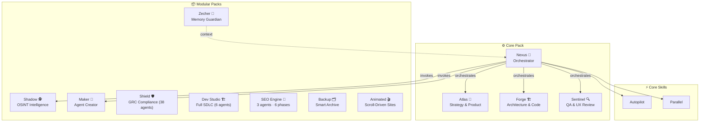

# 🚀 BMAD+ — Augmented Multi-Agent AI Framework

[](CHANGELOG.md)
[](https://github.com/bmad-code-org/BMAD-METHOD)
[](LICENSE)

<div align="center">
  🌐 <b>English</b> | <a href="readme-international/README.fr.md">Français</a> | <a href="readme-international/README.es.md">Español</a> | <a href="readme-international/README.de.md">Deutsch</a>
</div>

> **56+ multi-role agents · 9 modular packs · Autopilot mode · Parallel execution · 143 tests**
> Smart fork of [BMAD-METHOD](https://github.com/bmad-code-org/BMAD-METHOD) — Self-activating agents with 3-level context detection, GRC compliance (Shield), full SDLC pipeline (Dev Studio), OSINT intelligence, SEO audit, persistent cross-session memory, and a 10-language CLI installer.

---

## 📋 Table of Contents

- [What is BMAD+?](#-what-is-bmad)
- [Quick Start](#-quick-start)
- [The 56+ Agents](#the-56-agents)
- [Pack System](#-pack-system)
- [Innovations](#-innovations)
- [CLI Reference](#-cli-commands)
- [Supported IDEs](#-supported-ides)
- [Configuration](#-configuration)
- [Version History](#-version-history)
- [License](#-license)

---

## 💡 What is BMAD+?

BMAD+ is a **multi-agent AI framework** that turns your AI coding assistant into a full team. Install it in any project, talk to specialized agents by name, and let them handle strategy, architecture, code, testing, compliance, OSINT, SEO — everything from idea to production.

### At a Glance

```
┌─────────────────────────────────────────────────────────────────────┐
│  🚀 BMAD+ — What You Get                                          │
├─────────────────────────────────────────────────────────────────────┤
│                                                                     │
│  56+ Agents        Talk to Atlas, Forge, Sentinel, Nexus,            │
│                  Shadow, Zecher — each handles multiple roles       │
│                                                                     │
│  9 Packs         Core dev · OSINT · GRC compliance · SDLC          │
│                  · SEO audit · Memory · Backup · Maker · Animated  │
│                                                                     │
│  Autopilot       Say "autopilot" → Nexus orchestrates              │
│                  idea → PRD → architecture → code → tests → ship   │
│                                                                     │
│  Parallel        Independent tasks run concurrently                 │
│                  with conflict detection and supervision            │
│                                                                     │
│  Memory          Persistent brain across sessions                   │
│                  with project scanner and Karpathy guardrails       │
│                                                                     │
│  5 IDEs          Claude Code · Gemini CLI · Antigravity            │
│                  · Codex CLI · OpenCode — auto-detected             │
│                                                                     │
│  10 Languages    CLI installer in EN, FR, ES, DE, IT, PT,          │
│                  NL, RU, ZH, JA                                     │
│                                                                     │
│  143 Tests       Full functional + unit test coverage               │
│                                                                     │
└─────────────────────────────────────────────────────────────────────┘
```

### Not Just Development

| Domain | What BMAD+ Does | Agent/Pack |
|--------|----------------|------------|
| 📊 **Strategy** | Market research, SWOT, product briefs, PRDs, UX design | Atlas (Core) |
| 🏗️ **Development** | Architecture, TDD, code generation, documentation | Forge (Core) |
| 🔍 **Quality** | Code review, E2E tests, UX audit, accessibility | Sentinel (Core) |
| 🎼 **Management** | Sprint planning, story breakdown, retrospectives | Nexus (Core) |
| 🕵️ **OSINT** | Person investigation, social scraping, psychoprofiling | Shadow (OSINT Pack) |
| 🛡️ **Compliance** | GDPR, ISO 27001, SOC 2, HIPAA, EU AI Act — 25+ frameworks | 38 agents (Shield Pack) |
| 🔎 **SEO** | 6-phase audit, PageSpeed loop, Google APIs, competitor analysis | Scout/Chief/Judge (SEO Pack) |
| 🧠 **Memory** | Cross-session brain, decision recall, session handoffs | Zecher (Memory Pack) |
| 🧬 **Agent Creation** | Design, build, validate and package new agents | Maker (Maker Pack) |

### Why BMAD+ over BMAD-METHOD?

| BMAD-METHOD | BMAD+ |
|---|---|
| 9 specialized agents | **56+ agents** (12 roles total) |
| Manual activation only | **Intelligent auto-activation** at 3 levels |
| No automated pipeline | **Autopilot Mode**: idea → delivery |
| Sequential execution | **Supervised parallelism** |
| No persistent memory | **Cross-session brain** with project scanner |
| 1-2 IDEs supported | **5 IDEs** with auto-detection |
| 1 module | **9 modular packs** (Core, OSINT, Shield, Dev Studio, SEO, Memory...) |

---

## ⚡ Quick Start

### Installation in an existing project

```bash
npx bmad-plus install
```

The installer:
1. Automatically detects installed IDEs (Claude Code, Gemini CLI, Codex, etc.)
2. Offers packs to install (Core, OSINT, Maker, Audit)
3. Generates adapted configuration files
4. Creates artifact folders

### Usage after installation

#### 💬 Who to talk to?

**📊 Strategy & Discovery**

| You want to... | Talk to | Example |
|---|---|---|
| Brainstorm a project idea | **Atlas** 🎯 | `Atlas, I have a project idea: a billing SaaS` |
| Market/domain research | **Atlas** 🎯 | `Atlas, analyze the market for AI note-taking apps` |
| Create a PRD / Product Brief | **Atlas** 🎯 | `Atlas, create the PRD for my project` |
| Design UX wireframes | **Atlas** 🎯 | `Atlas, design the UX for the onboarding flow` |

**🏗️ Architecture & Development**

| You want to... | Talk to | Example |
|---|---|---|
| Design technical architecture | **Forge** 🏗️ | `Forge, propose an architecture for the app` |
| Implement a user story | **Forge** 🏗️ | `Forge, implement story AUTH-001` |
| Write/update documentation | **Forge** 🏗️ | `Forge, document the API` |
| Quick hotfix or small change | **Forge** 🏗️ | `Forge, quick dev: add a loading spinner` |

**🔍 Quality & Review**

| You want to... | Talk to | Example |
|---|---|---|
| Code review | **Sentinel** 🔍 | `Sentinel, review the auth module` |
| Write tests (unit/E2E) | **Sentinel** 🔍 | `Sentinel, write E2E tests for checkout` |
| UX/accessibility audit | **Sentinel** 🔍 | `Sentinel, review the UX of the dashboard` |

**🎼 Project Management**

| You want to... | Talk to | Example |
|---|---|---|
| Plan a sprint | **Nexus** 🎼 | `Nexus, create epics and stories for the MVP` |
| Automate everything (A to Z) | **Nexus** 🎼 | `autopilot` then describe your project |
| Run tasks in parallel | **Nexus** 🎼 | `parallel` — auto-detects independent tasks |
| Sprint retrospective | **Nexus** 🎼 | `Nexus, run a retrospective on Sprint 3` |

**🕵️ Intelligence & Specialized Packs**

| You want to... | Talk to | Example |
|---|---|---|
| Investigate a person (OSINT) | **Shadow** 🕵️ | `Shadow, investigate John Doe` |
| Create a new BMAD+ agent | **Maker** 🧬 | `Maker, create a customer support agent` |
| Recall past decisions/context | **Zecher** 🧠 | `Zecher, what did we decide about the auth strategy?` |
| Session handoff summary | **Zecher** 🧠 | `Zecher, create a handoff for the next session` |


#### 🚀 Typical Workflow (manual mode)

```
1. "Atlas, brainstorm on my [project] idea"
   → Atlas analyzes, asks questions, proposes angles

2. "Atlas, create the product brief"
   → Deliverable: _bmad-output/discovery/product-brief.md

3. "Atlas, write the PRD"
   → Deliverable: _bmad-output/discovery/prd.md

4. "Forge, propose the architecture"
   → Deliverable: _bmad-output/discovery/architecture.md

5. "Nexus, break down into epics and stories"
   → Deliverable: _bmad-output/build/stories/

6. "Forge, implement story [X]"
   → Code generated + tests

7. "Sentinel, test and review"
   → QA report + suggestions
```

#### ⚡ Automatic Workflow (autopilot mode)

```
> autopilot
> "A billing SaaS for SMBs with quote management"
```

Nexus automatically orchestrates everything with checkpoints for your approval.

#### 💬 Key Commands

| Command | Description |
|----------|-------------|
| `bmad-help` | View all available agents and skills |
| `autopilot` | Nexus takes control of the complete pipeline |
| `parallel` | Launch multi-agent execution in parallel |


#### 🔧 CLI Commands

| Command | Description |
|---------|-------------|
| `npx bmad-plus install` | Interactive installer with pack selection and IDE detection |
| `npx bmad-plus scan [path]` | Discover and index projects in the global brain |
| `npx bmad-plus memory status` | Memory health report (project + global brain) |
| `npx bmad-plus memory export` | Export brain as portable Markdown archive |
| `npx bmad-plus doctor` | Check installation integrity |
| `npx bmad-plus update` | Update agents and skills (preserves config) |
| `npx bmad-plus uninstall` | Remove BMAD+ from current project |
| `npx bmad-plus autoconfig` | Smart project bootstrap — auto-detect, install, and configure |

#### 🔬 Advanced Install Options

```bash
# Non-interactive install — all packs, auto-detect IDEs
npx bmad-plus install --packs all --yes

# Install without overwriting IDE configs (CLAUDE.md, GEMINI.md, etc.)
npx bmad-plus install --tools none

# Install specific packs only
npx bmad-plus install --packs core,memory,osint

# Install in a different directory
npx bmad-plus install --directory /path/to/project
```

> **💡 Dogfooding tip:** Use `--tools none` when installing BMAD+ into a project that already has manually maintained IDE config files. This installs agents, skills, and memory without overwriting your existing `CLAUDE.md`, `GEMINI.md`, or `AGENTS.md`.

#### 🔍 Scan Options

```bash
# Scan a drive or directory for projects
npx bmad-plus scan D:\DEV

# Custom thresholds for project status
npx bmad-plus scan . --active-days 7 --paused-days 90

# Auto-index all without prompting
npx bmad-plus scan D:\DEV --yes --depth 6
```

> Status legend: 🟢 **active** (modified < 30 days), 🟡 **paused** (30–180 days), ⚪ **archived** (> 180 days). Thresholds are customizable with `--active-days` and `--paused-days`.

---

## 🏗️ Architecture



---

## 🎭 The 56+ Agents

### Atlas — Strategist 🎯

**Fuses:** Analyst (Mary) + Product Manager (John)

| Role | Specialty | Auto-activation |
|------|-----------|-----------------|
| **Analyst** | Market research, SWOT, benchmarks, domain expertise | "analyze", "market", "benchmark", new project |
| **Product Manager** | PRD, product briefs, user stories, roadmaps | "PRD", "roadmap", "MVP", planning phase |

**Capabilities:** Brainstorming (BP), Market Research (MR), Domain Research (DR), Technical Research (TR), Product Brief (CB), PRD (PR), UX Design (CU), Document Project (DP)

---

### Forge — Architect-Dev 🏗️

**Fuses:** Architect (Winston) + Developer (Amelia) + Tech Writer (Paige)

| Role | Specialty | Auto-activation |
|------|-----------|-----------------|
| **Architect** | Technical design, API, scalability, stack choice | "architecture", "API", "schema", +5 files modified |
| **Developer** | TDD implementation, code review, story execution | "implement", "code", "fix", post-architecture |
| **Tech Writer** | Documentation, Mermaid diagrams, changelogs | "document", "README", post-implementation |

**Capabilities:** Architecture (CA), Implementation Readiness (IR), Dev Story (DS), Code Review (CR), Quick Spec (QS), Quick Dev (QD), Document Project (DP)

**Critical actions (Dev role):**
- Read the ENTIRE story BEFORE implementation
- Execute tasks IN ORDER
- 100% passing tests BEFORE moving on
- NEVER lie about tests

---

### Sentinel — Quality 🔍

**Fuses:** QA Engineer (Quinn) + UX Designer (Sally)

| Role | Specialty | Auto-activation |
|------|-----------|-----------------|
| **QA Engineer** | API/E2E tests, edge cases, coverage, code review | "test", "QA", "bug", post-implementation |
| **UX Reviewer** | UX evaluation, accessibility, interaction design | "UX", "interface", "responsive", frontend changes |

**Capabilities:** QA Tests (QA), Code Review (CR), UX Design (CU)

---

### Nexus — Orchestrator 🎼

**Fuses:** Scrum Master (Bob) + Quick-Flow Solo Dev (Barry) + **Autopilot** (new) + **Parallel Supervisor** (new)

| Role | Specialty | Auto-activation |
|------|-----------|-----------------|
| **Scrum Master** | Sprint planning, stories, retros, course correction | "sprint", "planning", "backlog" |
| **Quick Flow** | Quick specs, hotfixes, minimum ceremony | "quick", "hotfix", "small fix" |
| **Autopilot** | Pipeline automated idea→delivery with checkpoints | "autopilot", "manage everything", autopilot mode |
| **Parallel Supervisor** | Concurrent multi-agent, conflict detection, reallocation | "parallel", independent tasks detected |

**Capabilities:** Sprint Planning (SP), Create Story (CS), Epics & Stories (ES), Retrospective (ER), Course Correction (CC), Sprint Status (SS), Quick Spec (QS), Quick Dev (QD), **Autopilot (AP)**, **Parallel (PL)**

---

### Shadow — OSINT Intelligence 🔍 *(OSINT Pack)*

**Complete OSINT investigation agent.**

| Capability | Description |
|-----------|-------------|
| **INV** | Complete investigation Phase 0→6 with scored dossier |
| **QS** | Quick multi-engine search |
| **LI/IG/FB** | LinkedIn, Instagram, Facebook scraping |
| **PP** | MBTI / Big Five psychoprofile |
| **CE** | Contact enrichment (email, phone) |
| **DG** | Diagnostic of available tools/APIs |

**Stack:** 55+ Apify actors, 7 search APIs, 100% Python stdlib, confidence grades A/B/C/D

---

### Maker — Agent Creator 🧬 *(Maker Pack)*

**Meta-agent that creates other agents.** Give it a description → it generates a complete package.

| Code | Description |
|------|-------------|
| **CA** | Create Agent — guided creation in 4 phases |
| **QA** | Quick Agent — fast creation with sensible defaults |
| **EA** | Edit Agent — modify an existing SKILL.md |
| **VA** | Validate Agent — check BMAD+ compliance |
| **PA** | Package Agent — generate the integration folder |

**Pipeline:** Discovery → Design (user validation) → Generation → Validation
**Output:** `_bmad-output/ready-to-integrate/` — ready to copy into BMAD+

---

### Zecher — Memory Guardian 🧠 *(Memory Pack)*

**Persistent cross-session brain agent.** Maintains project knowledge across conversations.

| Capability | Description |
|-----------|-------------|
| **Session Handoff** | Auto-creates session summaries with decisions, patterns, and lessons learned |
| **Context Recall** | Retrieves relevant past decisions/patterns at conversation start |
| **Brain Health** | Monitors memory files integrity and detects staleness |
| **Cross-Project** | Links project memory to the global brain (`~/.bmad-plus/brain/`) |
| **Karpathy Guardrails** | Prevents hallucinated memories — every entry needs source evidence |

**Memory files:** `decisions.md`, `lessons.md`, `patterns.md`, `context.md`, `sessions/`

---

## 📦 Pack System

BMAD+ uses a modular pack system. Core is always installed, additional packs are optional.

```
npx bmad-plus install

🎛️  Which packs to install?
   Core (Atlas, Forge, Sentinel, Nexus) is always included.

   🔍 OSINT — Shadow (investigation, scraping, psychoprofiling)
   🧬 Agent Creator — Maker (design, build, package)
   🛡️ Security Audit — Shield (vulnerability scan)
   🤖 Install everything
   None — Core only
```

| Pack | Agents | What it does | Status |
|------|--------|-------------|--------|
| ⚙️ **Core** | Atlas, Forge, Sentinel, Nexus | Full dev lifecycle: strategy → architecture → code → QA | ✅ Stable |
| 🔍 **OSINT** | Shadow | Person investigation, social scraping, psychoprofiling (55+ Apify actors) | ✅ Stable |
| 🧬 **Maker** | Maker | Design, build, validate, and package new BMAD+ agents | ✅ Stable |
| 🛡️ **Shield** | 38 compliance agents | GRC across 25+ frameworks: GDPR, ISO 27001, SOC 2, HIPAA, PCI DSS, EU AI Act, DORA, NIS2 | ✅ Stable |
| 🏗️ **Dev Studio** | 6 specialized SDLC agents | Full SDLC: brainstorm → PRD → architecture → TDD → review (30 workflows, BWML DSL) | ✅ Stable |
| 🔍 **SEO** | Scout, Chief, Judge | 6-phase SEO audit, PageSpeed perfection loop, Google APIs, competitor benchmark | ✅ Stable |
| 🗂️ **Backup** | Backup Agent | Timestamped ZIP with smart exclusions (node_modules, .git, dist...) | ✅ Stable |
| 🎬 **Animated** | Animated Website Agent | Luxury scroll-driven website from video input | ✅ Stable |
| 🧠 **Memory** | Zecher | Cross-session brain, project scanner, Karpathy guardrails | ✅ Stable |

Each pack defines:
- Its agents, skills, and workflows
- Required/optional API keys
- External packages (if applicable)
- Cohabitation rules with other packs

---

## ✨ Innovations

### 1. 3-Level Intelligent Auto-Activation

Each agent can **automatically** switch roles when the context requires it:

| Level | Mechanism | Example |
|--------|-----------|---------|
| 🔤 **Pattern** | Keywords in the request | "review" → QA activated |
| 🌐 **Contextual** | Domain detected during work | Financial calculations → QA auto-activated after code |
| 🧠 **Reasoning** | Logic chain during execution | Architecture inconsistency → Architect auto-activated |

The agent **announces** its auto-activations: *"💡 I'm switching to QA mode — financial calculations detected. Say 'skip' to stay in current mode."*

Configuration: `src/bmad-plus/data/role-triggers.yaml`

### 2. Autopilot Mode

Give a project idea → Nexus orchestrates the complete pipeline:

```
📋 Discovery (Atlas)
  └→ Brainstorming → Product Brief → PRD → UX Design
  🔴 CHECKPOINT: PRD Approval

🏗️ Build (Forge + Sentinel)
  └→ Architecture → Epics → Stories → Sprint
  🔴 CHECKPOINT: Architecture Approval
  └→ For each story: Code → Tests → (retry if failed, max 3)
  🟡 NOTIFY: Story status

🚀 Ship (Sentinel + Forge)
  └→ Code Review → UX Review → Documentation → Retro
  🔴 CHECKPOINT: Final approval
```

**Configurable checkpoints:**
- `require_approval` (🔴) — Pause, WhatsApp notification, wait
- `notify_only` (🟡) — Notification, continues unless intervened
- `auto` (🟢) — Continues automatically

### 3. Supervised Parallel Execution

The Orchestrator detects independent tasks and launches them in parallel:

| Parallelizable ✅ | Sequential 🚫 |
|---|---|
| Stories without dependencies | Same file modified |
| Research + tech audit | Story B depends on Story A |
| Tests + documentation | Architecture before code |

**Supervision actions:** Launch, Monitor, Stop, Restart, Reallocate, Escalate (3 failures → human notification)

---

## 🖥️ Supported IDEs

The installer automatically detects IDEs and generates configs:

| IDE | Config File | Detection |
|-----|---------------|-----------|
| Claude Code | `CLAUDE.md` | `.claude/` folder |
| Gemini CLI | `GEMINI.md` | `.gemini/` folder |
| Antigravity | `.gemini/` + `.agents/` | Antigravity Extension |
| Codex CLI | `AGENTS.md` | `.codex/` folder |
| OpenCode | `OPENCODE.md` | opencode config |


## ⚙️ Configuration

### Module variables (`module.yaml`)

| Variable | Description | Values |
|----------|-------------|---------|
| `project_name` | Project name | Auto-detected |
| `user_skill_level` | Dev level | beginner, intermediate, expert |
| `execution_mode` | Execution mode | manual, autopilot, hybrid |
| `auto_role_activation` | Role auto-switch| true, false |
| `parallel_execution` | Parallelism | true, false |
| `install_packs` | Installed packs | core, osint, maker, audit, all |

### API Keys (depending on packs)

| Key | Pack | Usage |
|-----|------|-------|
| `GEMINI_API_KEY` | Monitor | AI Analysis of upstream diffs |
| `EVOLUTION_API_KEY` | Monitor | WhatsApp Notifications |
| `APIFY_API_TOKEN` | OSINT | Social media scraping |
| `PERPLEXITY_API_KEY` | OSINT | Enriched search |

---

## 📜 Version History

| Version | Date | Description |
|---------|------|-------------|
| **0.1.0** | 2026-03-17 | 🎉 Foundation — 56+ agents (Atlas, Forge, Sentinel, Nexus, Shadow, Maker), 3 skills, pack system, monitoring, multi-IDE support |
| **0.2.0** | 2026-03-18 | 🔀 Oveanet Fusion — 3 new utility packs: SEO Audit 360, Universal Backup, Animated Website |
| **0.3.0** | 2026-03-19 | 🚀 SEO Engine v2.0 — 3 multi-role agents, 4 Python scripts, 6-phase workflow, PageSpeed loop, GEO analysis |
| **0.4.0** | 2026-03-19 | 🏢 SEO Engine v2.1 — SKILL.md orchestrator, Google APIs, HTML reports, competitor benchmark, 50 tests, GSC + GA4 extensions |
| **0.4.1** | 2026-03-19 |
| **0.4.2** | 2026-03-19 |  Public packs  SEO/Backup/Animated agents now in npm package | 🌐 10-language CLI, CI/CD pipeline, `.npmignore`, `/deploy` workflow, security hardening |
| **0.4.3** | 2026-05-17 | 🔧 update + doctor commands, i18n complete, credits fix |
| **0.4.4** | 2026-05-17 | 🔧 UTF-8 encoding fix, complete i18n 10 languages, 62 unit tests |
| **0.5.0** | 2026-05-17 | 🛡️ **Pack Shield** — 38 GRC compliance agents, 7 categories, 25+ frameworks (GDPR, ISO 27001, SOC 2, EU AI Act...) |
| **0.6.0** | 2026-05-17 | 🏗️ **Pack Dev Studio** — 6 SDLC agents (Miriam, Yosef, Bezalel...) + 30 SDLC workflows, BWML DSL |
| **0.9.0** | 2026-06-24 | 🚀 **Augmented & Secure** — 3 new packs (animated, backup, seo), P0 security remediation, 143/143 tests |
| **0.8.0** | 2026-06-24 | 🚀 **Augmented & Secure** — 3 new packs (animated, backup, seo), P0 security remediation, 143/143 tests |

See [CHANGELOG.md](CHANGELOG.md) for full details.

---

## 📄 License

MIT — Based on [BMAD-METHOD](https://github.com/bmad-code-org/BMAD-METHOD) (MIT)

### Credits

**Creator**
- **BMAD+** Created by [Laurent Rochetta](https://github.com/lrochetta) ([LinkedIn](https://www.linkedin.com/in/laurentrochetta/))

**Original Packs** (created by Laurent Rochetta)
- **Dev Studio** — 6 specialized SDLC agents: Miriam (business analyst), Huldah (tech writer), Yosef (product manager), Rachel (UX designer), Bezalel (system architect), Oholiab (senior engineer) — 44 workflows covering the full lifecycle from brainstorming to deployment
- **SEO Engine** — 3 agents (Scout, Chief, Judge), 6-phase audit pipeline, PageSpeed perfection loop, Google Search Console & GA4 integrations
- **Memory Pack** — Zecher agent for persistent cross-session brain with project scanner

**External Sources & Inspirations**
- **BMAD-METHOD** by [bmad-code-org](https://github.com/bmad-code-org/BMAD-METHOD) — Original multi-agent methodology (MIT)
- **Shield GRC** — 38 compliance agents built on public regulatory texts (GDPR, ISO 27001, SOC 2, HIPAA, EU AI Act, DORA, NIST, CMMC, etc.)
- **OSINT Pipeline** based on [smixs/osint-skill](https://github.com/smixs/osint-skill) (MIT)
- **Apify Actor Runner** integrated from [apify/agent-skills](https://github.com/apify/agent-skills) (MIT)
- **Karpathy Guardrails** adapted from [Andrej Karpathy](https://github.com/multica-ai/andrej-karpathy-skills) (MIT) — Behavioral rules for Memory Pack

**Tools & Infrastructure**
- [Evolution API](https://github.com/EvolutionAPI/evolution-api) — WhatsApp notifications for upstream monitoring
- [Gemini API](https://ai.google.dev/) — AI analysis for upstream change classification
