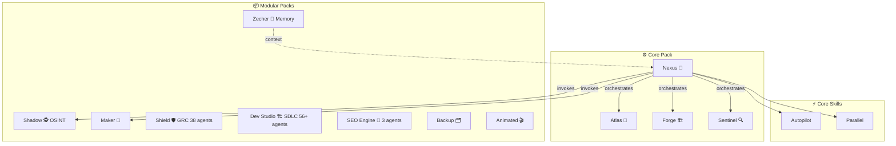

# 🚀 BMAD+ — Erweitertes Multi-Agent KI-Framework

[](../CHANGELOG.md)
[](https://github.com/bmad-code-org/BMAD-METHOD)
[](../LICENSE)

<div align="center">
  <a href="../README.md">English</a> | <a href="README.fr.md">Français</a> | <a href="README.es.md">Español</a> | 🌐 <b>Deutsch</b>
</div>

> **6 Multirole-Agenten · 9 modulare Packs · Autopilot-Modus · Parallele Ausführung · 143 Tests**
> Intelligenter Fork von [BMAD-METHOD](https://github.com/bmad-code-org/BMAD-METHOD) — Selbstaktivierende Agenten mit 3-Stufen-Kontexterkennung, GRC-Compliance (Shield), vollständige SDLC-Pipeline (Dev Studio), OSINT-Intelligence, SEO-Audit, persistentes Cross-Session-Gedächtnis und 10-Sprachen CLI-Installer.

---

## 📋 Inhaltsverzeichnis

- [Warum BMAD+?](#-warum-bmad-)
- [Schnellstart](#-schnellstart)
- [Architektur](#-architektur)
- [Die 6 Agenten](#-die-6-agenten)
- [Pack-System](#-pack-system)
- [Innovationen](#-innovationen)
- [Unterstützte IDEs](#-unterstützte-ides)
- [Upstream Monitoring](#-upstream-monitoring)
- [Projektstruktur](#-projektstruktur)
- [Konfiguration](#-konfiguration)
- [Versionshistorie](#-versionshistorie)
- [Lizenz](#-lizenz)

---

## 💡 Warum BMAD+?

BMAD-METHOD ist ein exzellentes Framework mit 9 spezialisierten Agenten. Für einen Solo-Entwickler oder ein kleines Team sind 9 Agenten jedoch zu fragmentiert. BMAD+ löst dieses Problem:

| BMAD-METHOD | BMAD+ |
|---|---|
| 9 spezialisierte Agenten | **56+ Agenten** (insgesamt 12 Rollen) |
| Nur manuelle Aktivierung | **Intelligente automatische Aktivierung** auf 3 Ebenen |
| Keine automatisierte Pipeline | **Autopilot-Modus**: Idee → Fertigstellung |
| Sequentielle Ausführung | **Überwachte parallele Ausführung** |
| Kein Upstream-Tracking | **Wöchentliches Monitoring** mit WhatsApp |
| 1-2 unterstützte IDEs | **5 IDEs** mit automatischer Erkennung |

---

## ⚡ Schnellstart

### Installation in einem bestehenden Projekt

```bash
npx bmad-plus install
```

Das Installationsprogramm:
1. Erkennt automatisch installierte IDEs (Claude Code, Gemini CLI, Codex, usw.)
2. Bietet Packs zur Installation an (Core, OSINT, Maker, Audit)
3. Generiert angepasste Konfigurationsdateien
4. Erstellt Ordner für Artefakte

### Verwendung nach der Installation

#### 💬 Mit wem soll ich sprechen?

**📊 Strategie & Entdeckung**

| Du möchtest... | Sprich mit | Beispiel |
|---|---|---|
| Eine Projektidee brainstormen | **Atlas** 🎯 | `Atlas, ich habe eine Projektidee: ein Abrechnungs-SaaS` |
| Markt-/Domänenforschung | **Atlas** 🎯 | `Atlas, analysiere den Markt für KI-Notiz-Apps` |
| Ein PRD / Product Brief erstellen | **Atlas** 🎯 | `Atlas, erstelle das PRD für mein Projekt` |
| UX-Wireframes entwerfen | **Atlas** 🎯 | `Atlas, entwirf die UX für den Onboarding-Flow` |

**🏗️ Architektur & Entwicklung**

| Du möchtest... | Sprich mit | Beispiel |
|---|---|---|
| Technische Architektur entwerfen | **Forge** 🏗️ | `Forge, schlage eine Architektur für die App vor` |
| Eine User Story umsetzen | **Forge** 🏗️ | `Forge, setze die Story AUTH-001 um` |
| Dokumentation schreiben/aktualisieren | **Forge** 🏗️ | `Forge, dokumentiere die API` |
| Schneller Hotfix oder kleine Änderung | **Forge** 🏗️ | `Forge, quick dev: füge einen Lade-Spinner hinzu` |

**🔍 Qualität & Review**

| Du möchtest... | Sprich mit | Beispiel |
|---|---|---|
| Code Review | **Sentinel** 🔍 | `Sentinel, überprüfe das Auth-Modul` |
| Tests schreiben (Unit/E2E) | **Sentinel** 🔍 | `Sentinel, schreibe E2E-Tests für den Checkout` |
| UX-/Barrierefreiheits-Audit | **Sentinel** 🔍 | `Sentinel, überprüfe die UX des Dashboards` |

**🎼 Projektmanagement**

| Du möchtest... | Sprich mit | Beispiel |
|---|---|---|
| Einen Sprint planen | **Nexus** 🎼 | `Nexus, erstelle Epics und Storys für das MVP` |
| Alles automatisieren (A bis Z) | **Nexus** 🎼 | `autopilot` und beschreibe dann dein Projekt |
| Aufgaben parallel ausführen | **Nexus** 🎼 | `parallel` — erkennt automatisch unabhängige Aufgaben |
| Sprint-Retrospektive | **Nexus** 🎼 | `Nexus, starte eine Retro für Sprint 3` |

**🕵️ Intelligence & Spezialisierte Packs**

| Du möchtest... | Sprich mit | Beispiel |
|---|---|---|
| Eine Person recherchieren (OSINT) | **Shadow** 🕵️ | `Shadow, untersuche John Doe` |
| Einen neuen BMAD+ Agenten erstellen | **Maker** 🧬 | `Maker, erstelle einen Kundensupport-Agenten` |
| Vergangene Entscheidungen abrufen | **Zecher** 🧠 | `Zecher, was haben wir zur Auth-Strategie entschieden?` |
| Sitzungs-Zusammenfassung (Handoff) | **Zecher** 🧠 | `Zecher, erstelle einen Handoff für die nächste Sitzung` |

#### 🚀 Typischer Workflow (manueller Modus)

```
1. "Atlas, mache ein Brainstorming zu meiner [Projekt]-Idee"
   → Atlas analysiert, stellt Fragen, schlägt Ansätze vor

2. "Atlas, erstelle den Product Brief"
   → Artefakt: _bmad-output/discovery/product-brief.md

3. "Atlas, verfasse das PRD"
   → Artefakt: _bmad-output/discovery/prd.md

4. "Forge, schlage die Architektur vor"
   → Artefakt: _bmad-output/discovery/architecture.md

5. "Nexus, zerlege in Epics und Storys"
   → Artefakt: _bmad-output/build/stories/

6. "Forge, implementiere die Story [X]"
   → Generierter Code + Tests

7. "Sentinel, teste und überprüfe"
   → QA-Bericht + Vorschläge
```

#### ⚡ Automatischer Workflow (Autopilot-Modus)

```
> autopilot
> "Ein Abrechnungs-SaaS für KMUs mit Angebotsverwaltung"
```

Nexus orchestriert alles automatisch mit Checkpoints für deine Genehmigung.

#### 💬 Wichtige Befehle

| Befehl | Beschreibung |
|----------|-------------|
| `bmad-help` | Alle verfügbaren Agenten und Skills anzeigen |
| `autopilot` | Nexus übernimmt die Kontrolle über die gesamte Pipeline |
| `parallel` | Multirole-Agenten-Ausführung parallel starten |


#### 🔧 CLI-Befehle

| Befehl | Beschreibung |
|---------|-------------|
| `npx bmad-plus install` | Interaktives Installationsprogramm mit Pack-Auswahl und IDE-Erkennung |
| `npx bmad-plus scan [Pfad]` | Projekte entdecken und im globalen Gedächtnis indexieren |
| `npx bmad-plus memory status` | Statusbericht des Gedächtnisses (Projekt + globales Gehirn) |
| `npx bmad-plus memory export` | Gehirn als portables Markdown-Archiv exportieren |
| `npx bmad-plus doctor` | Installationsintegrität prüfen |
| `npx bmad-plus update` | Agenten und Skills aktualisieren (Konfiguration bleibt erhalten) |
| `npx bmad-plus uninstall` | BMAD+ vom aktuellen Projekt entfernen |
| `npx bmad-plus autoconfig` | Intelligentes Bootstrap — Auto-Erkennung, Installation und Konfiguration |

#### 🔬 Erweiterte Installationsoptionen

```bash
# Nicht-interaktive Installation — alle Packs, Auto-IDE-Erkennung
npx bmad-plus install --packs all --yes

# Installieren ohne IDE-Konfigurationen zu überschreiben (CLAUDE.md, GEMINI.md, usw.)
npx bmad-plus install --tools none

# Nur bestimmte Packs installieren
npx bmad-plus install --packs core,memory,osint

# In ein anderes Verzeichnis installieren
npx bmad-plus install --directory /pfad/zum/projekt
```

> **💡 Dogfooding-Tipp:** Verwende `--tools none`, wenn BMAD+ in einem Projekt installiert wird, das bereits manuelle IDE-Konfigurationen hat. Es installiert Agenten, Skills und Gedächtnis, ohne deine `CLAUDE.md`, `GEMINI.md` oder `AGENTS.md` zu überschreiben.

#### 🔍 Scan-Optionen

```bash
# Laufwerk oder Verzeichnis scannen
npx bmad-plus scan D:\DEV

# Benutzerdefinierte Schwellenwerte für den Projektstatus
npx bmad-plus scan . --active-days 7 --paused-days 90

# Alles ohne Bestätigung auto-indexieren
npx bmad-plus scan D:\DEV --yes --depth 6
```

> Statuslegende: 🟢 **aktiv** (änderung < 30 Tage), 🟡 **pausiert** (30–180 Tage), ⚪ **archiviert** (> 180 Tage). Schwellenwerte mit `--active-days` und `--paused-days` anpassbar.

---

## 🏗️ Architektur



---

## 🎭 Die 6 Agenten

### Atlas — Strategist 🎯

**Verschmilzt:** Analyst (Mary) + Product Manager (John)

| Rolle | Spezialität | Automatische Aktivierung |
|------|-----------|-----------------|
| **Analyst** | Marktforschung, SWOT, Benchmarks | "analysieren", "Markt", "Benchmark", neues Projekt |
| **Product Manager** | PRD, Product Briefs, User Stories, Roadmaps | "PRD", "Roadmap", "MVP", Planungsphase |

**Fähigkeiten (Capabilities):** Brainstorming (BP), Market Research (MR), Domain Research (DR), Technical Research (TR), Product Brief (CB), PRD (PR), UX Design (CU), Document Project (DP)

---

### Forge — Architect-Dev 🏗️

**Verschmilzt:** Architect (Winston) + Developer (Amelia) + Tech Writer (Paige)

| Rolle | Spezialität | Automatische Aktivierung |
|------|-----------|-----------------|
| **Architect** | Technisches Design, API, Skalierbarkeit, Stack-Wahl | "Architektur", "API", "Schema", +5 Dateien geändert |
| **Developer** | TDD-Implementierung, Code Review, Story-Umsetzung | "implementieren", "Code", "Fix", nach Architektur |
| **Tech Writer** | Dokumentation, Mermaid-Diagramme, Changelogs | "dokumentieren", "README", nach Implementierung |

**Fähigkeiten:** Architecture (CA), Implementation Readiness (IR), Dev Story (DS), Code Review (CR), Quick Spec (QS), Quick Dev (QD), Document Project (DP)

---

### Sentinel — Quality 🔍

**Verschmilzt:** QA Engineer (Quinn) + UX Designer (Sally)

| Rolle | Spezialität | Automatische Aktivierung |
|------|-----------|-----------------|
| **QA Engineer** | API/E2E-Tests, Edge Cases, Coverage, Code Review | "Test", "QA", "Bug", nach Implementierung |
| **UX Reviewer** | UX-Bewertung, Barrierefreiheit, Interaction Design | "UX", "Interface", "Responsive", Frontend-Änderungen |

**Fähigkeiten:** QA Tests (QA), Code Review (CR), UX Design (CU)

---

### Nexus — Orchestrator 🎼

**Verschmilzt:** Scrum Master (Bob) + Quick-Flow Solo Dev (Barry) + **Autopilot** (neu) + **Parallel Supervisor** (neu)

| Rolle | Spezialität | Automatische Aktivierung |
|------|-----------|-----------------|
| **Scrum Master** | Sprint Planning, Stories, Retrospektiven, Kurskorrektur | "Sprint", "Planung", "Backlog" |
| **Quick Flow** | Schnelle Spezifikationen, Hotfixes, minimaler Aufwand | "schnell", "Hotfix", "kleiner Fix" |
| **Autopilot** | Automatisierte Pipeline Idee→Fertigstellung mit Checkpoints | "Autopilot", "alles verwalten", Autopilot-Modus |
| **Parallel Supervisor** | Gleichzeitige Multirole-Entwicklung, Konflikterkennung | "parallel", unabhängige Aufgaben erkannt |

**Fähigkeiten:** Sprint Planning (SP), Create Story (CS), Epics & Stories (ES), Retrospective (ER), Course Correction (CC), Sprint Status (SS), Quick Spec (QS), Quick Dev (QD), **Autopilot (AP)**, **Parallel (PL)**

---

### Shadow — OSINT Intelligence 🔍 *(OSINT Pack)*

**Umfassender OSINT-Untersuchungsagent.**

| Fähigkeit | Beschreibung |
|-----------|-------------|
| **INV** | Komplette Untersuchung Phase 0→6 mit bewertetem Dossier |
| **QS** | Schnelle Multi-Engine-Suche |
| **LI/IG/FB** | Scraping von LinkedIn, Instagram, Facebook |
| **PP** | MBTI / Big Five Psychoprofil |
| **CE** | Kontaktanreicherung (E-Mail, Telefon) |
| **DG** | Diagnose verfügbarer Tools/APIs |

**Stack:** 55+ Apify Actors, 7 Such-APIs, 100% Python stdlib, Vertrauensgrade A/B/C/D

---

### Maker — Agent Creator 🧬 *(Maker Pack)*

**Meta-Agent, der andere Agenten erstellt.** Gib ihm eine Beschreibung → er generiert ein komplettes Paket.

| Befehl | Beschreibung |
|------|-------------|
| **CA** | Create Agent — geführte Erstellung in 4 Phasen |
| **QA** | Quick Agent — schnelle Erstellung mit sinnvollen Vorgaben |
| **EA** | Edit Agent — eine bestehende SKILL.md ändern |
| **VA** | Validate Agent — BMAD+-Konformität prüfen |
| **PA** | Package Agent — den Integrations-Ordner generieren |

**Pipeline:** Discovery → Design (Benutzerfreigabe) → Generierung → Validierung
**Ausgabe:** `_bmad-output/ready-to-integrate/` — bereit zum Kopieren in BMAD+

---

### Zecher — Gedächtniswächter 🧠 *(Memory Pack)*

**Persistenter Cross-Session-Gedächtnis-Agent.** Bewahrt Projektwissen über Gespräche hinweg.

| Fähigkeit | Beschreibung |
|-----------|-------------|
| **Session Handoff** | Erstellt automatisch Sitzungszusammenfassungen mit Entscheidungen, Mustern und Lektionen |
| **Context Recall** | Ruft relevante vergangene Entscheidungen/Muster am Gesprächsbeginn ab |
| **Brain Health** | Überwacht die Integrität der Gedächtnisdateien und erkennt Veraltung |
| **Cross-Project** | Verbindet das Projektgedächtnis mit dem globalen Gehirn (`~/.bmad-plus/brain/`) |
| **Karpathy Guardrails** | Verhindert halluzinierte Erinnerungen — jeder Eintrag benötigt Quellennachweise |

**Gedächtnisdateien:** `decisions.md`, `lessons.md`, `patterns.md`, `context.md`, `sessions/`

---

## 📦 Pack-System

BMAD+ verwendet ein modulares Pack-System. Core ist immer installiert, zusätzliche Packs sind optional.

```
npx bmad-plus install

🎛️  Welche Packs sollen installiert werden?
   Core (Atlas, Forge, Sentinel, Nexus) ist immer enthalten.

   🔍 OSINT — Shadow (Untersuchung, Scraping, Psychoprofil)
   🧬 Agent Creator — Maker (Design, Build, Package)
   🛡️ Shield GRC — 38 Compliance-Agenten
   🏗️ Dev Studio — 6 Agenten + 30 SDLC-Workflows
   🔍 SEO Audit 360 — 3 Agenten (Scout, Chief, Judge)
   🗂️ Universal Backup — Intelligentes ZIP-Backup
   🎬 Animated Website — Luxus scroll-driven Seite aus Video
   🧠 Memory — Persistentes Gehirn + Projektscanner
   🤖 Alles installieren
   Keine — Nur Core
```

| Pack | Agenten | Beschreibung | Status |
|------|--------|-------------|--------|
| ⚙️ **Core** | Atlas, Forge, Sentinel, Nexus | Vollständiger Dev-Lebenszyklus: Strategie → Architektur → Code → QA | ✅ Stabil |
| 🔍 **OSINT** | Shadow | Personenermittlung, Social Scraping, Psychoprofil (55+ Apify Actors) | ✅ Stabil |
| 🧬 **Maker** | Maker | Neue BMAD+-Agenten entwerfen, bauen, validieren und verpacken | ✅ Stabil |
| 🛡️ **Shield** | 38 Compliance-Agenten | GRC über 25+ Frameworks: DSGVO, ISO 27001, SOC 2, HIPAA, PCI DSS, EU AI Act, DORA, NIS2 | ✅ Stabil |
| 🏗️ **Dev Studio** | 6 Torah-benannte Agenten | Vollständiger SDLC: Brainstorm → PRD → Architektur → TDD → Review (30 Workflows) | ✅ Stabil |
| 🔍 **SEO** | Scout, Chief, Judge | 6-Phasen SEO-Audit, PageSpeed-Schleife, Google APIs, Wettbewerbs-Benchmark | ✅ Stabil |
| 🗂️ **Backup** | Backup Agent | Zeitgestempeltes ZIP mit intelligenten Ausschlüssen | ✅ Stabil |
| 🎬 **Animated** | Animated Website Agent | Luxus scroll-driven Website aus Videoeingabe | ✅ Stabil |
| 🧠 **Memory** | Zecher | Cross-Session-Gehirn, Projektscanner, Karpathy-Leitplanken | ✅ Stabil |

Jedes Pack definiert:
- Seine Agenten, Fähigkeiten und Workflows
- Erforderliche/optionale API-Schlüssel
- Externes Paket (falls zutreffend)
- Kohabitations-Regeln mit anderen Packs

---

## ✨ Innovationen

### 1. 3-Stufige intelligente automatische Aktivierung

Jeder Agent kann **automatisch** seine Rolle wechseln, wenn der Kontext dies erfordert:

| Stufe | Mechanismus | Beispiel |
|--------|-----------|---------|
| 🔤 **Muster** | Schlüsselwörter in der Anfrage | "review" → QA aktiviert |
| 🌐 **Kontextuell** | Bei der Arbeit erkannte Domäne | Finanzielle Berechnungen → QA nach dem Code automatisch aktiviert |
| 🧠 **Logik** | Logikketten während der Ausführung | Architektur-Inkonsistenz → Architekt automatisch aktiviert |

Der Agent **kündigt** seine automatische Aktivierung an: *"💡 I'm switching to QA mode — financial calculations detected. Say 'skip' to stay in current mode."*

### 2. Autopilot-Modus

Eine Projektidee eingeben → Nexus orchestriert die komplette Pipeline:

```
📋 Discovery (Atlas)
  └→ Brainstorming → Product Brief → PRD → UX Design
  🔴 CHECKPOINT: PRD-Genehmigung
```

(Rest des Pipelines entspricht dem Standard-Prozess)

### 3. Überwachte parallele Ausführung

| Parallelisierbar ✅ | Sequentiell 🚫 |
|---|---|
| Stories ohne Abhängigkeiten | Gleiche Datei geändert |
| Research + technisches Audit | Story B hängt von Story A ab |
| Tests + Dokumentation | Architektur vor Code |

---

## 🖥️ Unterstützte IDEs

Das Installationsprogramm erkennt IDEs automatisch und generiert Konfigurationen:

| IDE | Konfigurationsdatei | Erkennung |
|-----|---------------|-----------|
| Claude Code | `CLAUDE.md` | `.claude/` Ordner |
| Gemini CLI | `GEMINI.md` | `.gemini/` Ordner |
| Antigravity | `.gemini/` + `.agents/` | Antigravity-Erweiterung |
| Codex CLI | `AGENTS.md` | `.codex/` Ordner |
| OpenCode | `OPENCODE.md` | opencode-Konfiguration |

---

## 📡 Upstream Monitoring

### Wöchentliche Pipeline (VPS Cron, Montag 9 Uhr)

```
1. holt BMAD-METHOD-Updates
2. Diff-Analyse über KI der Dateien (Gemini AI)
3. WhatsApp Benachrichtigung & GH PR Log
```

---

## 📁 Projektstruktur

```
BMAD+/
├── README.md                      ← Diese Datei (Englisch)
├── readme-international/          ← Übersetzte READMEs (fr, es, de)
├── CHANGELOG.md                   ← Versionierung
├── CLAUDE.md / GEMINI.md / AGENTS.md ← IDE-Konfigurationen
```

(Detaillierte interne Struktur befindet sich in der Hauptbibliothek)

---

## ⚙️ Konfiguration (module.yaml)

- `project_name` (Name des Projekts)
- `execution_mode` (manual, autopilot, hybrid)
- API Keys: `GEMINI_API_KEY`, `EVOLUTION_API_KEY`, `APIFY_API_TOKEN`, usw.

---

## 📜 Versionshistorie

| Version | Datum | Beschreibung |
|---------|------|-------------|
| **0.1.0** | 2026-03-17 | 🎉 Foundation — 6 Agenten (Atlas, Forge, Sentinel, Nexus, Shadow, Maker), 3 Skills, Pack-System, Monitoring, IDE Support |
| **0.5.0** | 2026-05-17 | 🛡️ **Pack Shield** — 38 GRC-Compliance-Agenten |
| **0.6.0** | 2026-05-17 | 🏗️ **Pack Dev Studio** — 6 Torah-benannte Agenten + 30 SDLC-Workflows |
| **0.7.5** | 2026-05-17 | 🩺 **Qualität & Compliance** — MIT LICENSE, 143 Tests, Scan, Autoconfig, globales Gedächtnis |

Siehe [CHANGELOG.md](../CHANGELOG.md) für vollständige Details.

---

## 📄 Lizenz

MIT — Basierend auf [BMAD-METHOD](https://github.com/bmad-code-org/BMAD-METHOD) (MIT)

### Danksagungen
- **BMAD-METHOD** von [bmad-code-org](https://github.com/bmad-code-org)
- **OSINT Pipeline** von [smixs/osint-skill](https://github.com/smixs/osint-skill) (MIT)
- **Apify Actor Runner** von [apify/agent-skills](https://github.com/apify/agent-skills) (MIT)
