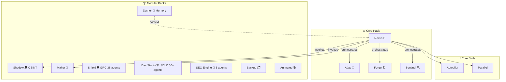

# 🚀 BMAD+ — Framework Multi-Agente IA Aumentado

[](../CHANGELOG.md)
[](https://github.com/bmad-code-org/BMAD-METHOD)
[](../LICENSE)

<div align="center">
  <a href="../README.md">English</a> | <a href="README.fr.md">Français</a> | 🌐 <b>Español</b> | <a href="README.de.md">Deutsch</a>
</div>

> **56+ agentes multirrol · 9 packs modulares · Modo Autopilot · Ejecución paralela · 143 tests**
> Fork inteligente de [BMAD-METHOD](https://github.com/bmad-code-org/BMAD-METHOD) — Agentes auto-activables con detección contextual en 3 niveles, cumplimiento GRC (Shield), pipeline SDLC completo (Dev Studio), inteligencia OSINT, auditoría SEO, memoria persistente cross-session e instalador CLI en 10 idiomas.

---

## 📋 Tabla de contenidos

- [¿Por qué BMAD+?](#-por-qué-bmad-)
- [Inicio Rápido](#-inicio-rápido)
- [Arquitectura](#-arquitectura)
- [Los 56+ Agentes](#los-56-agentes)
- [Sistema de Packs](#-sistema-de-packs)
- [Innovaciones](#-innovaciones)
- [IDE Soportados](#-ide-soportados)
- [Monitorización Upstream](#-monitorización-upstream)
- [Estructura del Proyecto](#-estructura-del-proyecto)
- [Configuración](#-configuración)
- [Historial de Versiones](#-historial-de-versiones)
- [Licencia](#-licencia)

---

## 💡 ¿Por qué BMAD+?

BMAD-METHOD es un excelente framework con 9 agentes especializados. Pero para un desarrollador en solitario o un equipo pequeño, 9 agentes está demasiado fragmentado. BMAD+ resuelve este problema:

| BMAD-METHOD | BMAD+ |
|---|---|
| 9 agentes especializados | **56+ agentes** (12 roles en total) |
| Activación manual únicamente | **Auto-activación inteligente** en 3 niveles |
| Sin pipeline automatizado | **Modo Autopilot**: idea → entrega |
| Ejecución secuencial | **Paralelismo supervisado** |
| Sin seguimiento upstream | **Monitorización semanal** con WhatsApp |
| 1-2 IDEs soportados | **5 IDEs** con auto-detección |

---

## ⚡ Inicio Rápido

### Instalación en un proyecto existente

```bash
npx bmad-plus install
```

El instalador:
1. Detecta automáticamente los IDE instalados (Claude Code, Gemini CLI, Codex, etc.)
2. Ofrece los packs a instalar (Core, OSINT, Maker, Audit)
3. Genera los archivos de configuración adaptados
4. Crea las carpetas de artefactos

### Uso después de la instalación

#### 💬 ¿Con quién hablar?

**📊 Estrategia & Descubrimiento**

| Quieres... | Habla con | Ejemplo |
|---|---|---|
| Brainstorming de una idea | **Atlas** 🎯 | `Atlas, tengo una idea de proyecto: un SaaS de facturación` |
| Investigación de mercado/dominio | **Atlas** 🎯 | `Atlas, analiza el mercado de apps de notas con IA` |
| Crear un PRD / Product Brief | **Atlas** 🎯 | `Atlas, crea el PRD para mi proyecto` |
| Diseñar wireframes UX | **Atlas** 🎯 | `Atlas, diseña la UX del flujo de onboarding` |

**🏗️ Arquitectura & Desarrollo**

| Quieres... | Habla con | Ejemplo |
|---|---|---|
| Diseñar arquitectura técnica | **Forge** 🏗️ | `Forge, propón una arquitectura para la app` |
| Implementar una user story | **Forge** 🏗️ | `Forge, implementa la historia AUTH-001` |
| Escribir/actualizar documentación | **Forge** 🏗️ | `Forge, documenta la API` |
| Hotfix rápido o cambio pequeño | **Forge** 🏗️ | `Forge, quick dev: agrega un spinner de carga` |

**🔍 Calidad & Revisión**

| Quieres... | Habla con | Ejemplo |
|---|---|---|
| Revisión de código | **Sentinel** 🔍 | `Sentinel, revisa el módulo auth` |
| Escribir tests (unit/E2E) | **Sentinel** 🔍 | `Sentinel, escribe tests E2E para el checkout` |
| Auditoría UX / accesibilidad | **Sentinel** 🔍 | `Sentinel, revisa la UX del dashboard` |

**🎼 Gestión de Proyecto**

| Quieres... | Habla con | Ejemplo |
|---|---|---|
| Planificar un sprint | **Nexus** 🎼 | `Nexus, crea épicas e historias para el MVP` |
| Automatizar todo (A a Z) | **Nexus** 🎼 | `autopilot` luego describe tu proyecto |
| Ejecutar tareas en paralelo | **Nexus** 🎼 | `parallel` — detecta auto tareas independientes |
| Retrospectiva de sprint | **Nexus** 🎼 | `Nexus, ejecuta una retro del Sprint 3` |

**🕵️ Inteligencia & Packs Especializados**

| Quieres... | Habla con | Ejemplo |
|---|---|---|
| Investigar a una persona (OSINT) | **Shadow** 🕵️ | `Shadow, investiga a John Doe` |
| Crear un nuevo agente BMAD+ | **Maker** 🧬 | `Maker, crea un agente de soporte al cliente` |
| Recordar decisiones pasadas | **Zecher** 🧠 | `Zecher, ¿qué decidimos sobre la estrategia de auth?` |
| Resumen de sesión (handoff) | **Zecher** 🧠 | `Zecher, crea un handoff para la próxima sesión` |

#### 🚀 Flujo de trabajo típico (modo manual)

```
1. "Atlas, haz una lluvia de ideas sobre mi [proyecto]"
   → Atlas analiza, hace preguntas, propone enfoques

2. "Atlas, crea el product brief"
   → Entregable: _bmad-output/discovery/product-brief.md

3. "Atlas, redacta el PRD"
   → Entregable: _bmad-output/discovery/prd.md

4. "Forge, propón la arquitectura"
   → Entregable: _bmad-output/discovery/architecture.md

5. "Nexus, divide en épicas e historias"
   → Entregable: _bmad-output/build/stories/

6. "Forge, implementa la historia [X]"
   → Código generado + pruebas

7. "Sentinel, prueba y revisa"
   → Informe de QA + sugerencias
```

#### ⚡ Flujo de trabajo automático (modo autopilot)

```
> autopilot
> "Un SaaS de facturación para pymes con gestión de presupuestos"
```

Nexus orquesta todo automáticamente con puntos de control (checkpoints) para tu aprobación.

#### 💬 Comandos clave

| Comando | Descripción |
|----------|-------------|
| `bmad-help` | Ver todos los agentes y habilidades disponibles |
| `autopilot` | Nexus toma el control del pipeline completo |
| `parallel` | Iniciar ejecución multi-agente en paralelo |


#### 🔧 Comandos CLI

| Comando | Descripción |
|---------|-------------|
| `npx bmad-plus install` | Instalador interactivo con selección de packs y detección IDE |
| `npx bmad-plus scan [ruta]` | Descubrir e indexar proyectos en el cerebro global |
| `npx bmad-plus memory status` | Informe de salud de memoria (proyecto + cerebro global) |
| `npx bmad-plus memory export` | Exportar cerebro como archivo Markdown portable |
| `npx bmad-plus doctor` | Verificar integridad de la instalación |
| `npx bmad-plus update` | Actualizar agentes y skills (preserva la config) |
| `npx bmad-plus uninstall` | Eliminar BMAD+ del proyecto actual |
| `npx bmad-plus autoconfig` | Bootstrap inteligente — detección auto, instalación y configuración |

#### 🔬 Opciones de instalación avanzadas

```bash
# Instalación no-interactiva — todos los packs, auto-detección IDE
npx bmad-plus install --packs all --yes

# Instalar sin sobrescribir configs IDE (CLAUDE.md, GEMINI.md, etc.)
npx bmad-plus install --tools none

# Instalar packs específicos
npx bmad-plus install --packs core,memory,osint

# Instalar en otro directorio
npx bmad-plus install --directory /ruta/al/proyecto
```

> **💡 Consejo dogfooding:** Usa `--tools none` cuando BMAD+ se instala en un proyecto que ya tiene configs IDE manuales. Instala agentes, skills y memoria sin sobrescribir tus `CLAUDE.md`, `GEMINI.md` o `AGENTS.md`.

#### 🔍 Opciones de scan

```bash
# Escanear un disco o directorio
npx bmad-plus scan D:\DEV

# Umbrales personalizados para el estado del proyecto
npx bmad-plus scan . --active-days 7 --paused-days 90

# Auto-indexar todo sin confirmación
npx bmad-plus scan D:\DEV --yes --depth 6
```

> Leyenda de estados: 🟢 **activo** (modificado < 30 días), 🟡 **en pausa** (30–180 días), ⚪ **archivado** (> 180 días). Umbrales personalizables con `--active-days` y `--paused-days`.

---

## 🏗️ Arquitectura



---

## 🎭 Los 56+ Agentes

### Atlas — Strategist 🎯

**Fusiona:** Analyst (Mary) + Product Manager (John)

| Rol | Especialidad | Auto-activación |
|------|-----------|-----------------|
| **Analyst** | Investigación de mercado, FODA, benchmarks | "analiza", "mercado", "benchmark", nuevo proyecto |
| **Product Manager** | PRD, product briefs, historias de usuario, roadmaps | "PRD", "roadmap", "MVP", fase de planificación |

**Capacidades:** Brainstorming (BP), Market Research (MR), Domain Research (DR), Technical Research (TR), Product Brief (CB), PRD (PR), UX Design (CU), Document Project (DP)

---

### Forge — Architect-Dev 🏗️

**Fusiona:** Architect (Winston) + Developer (Amelia) + Tech Writer (Paige)

| Rol | Especialidad | Auto-activación |
|------|-----------|-----------------|
| **Architect** | Diseño técnico, API, escalabilidad, elección de stack | "arquitectura", "API", "schema", +5 archivos modificados |
| **Developer** | Implementación TDD, revisión de código, historias | "implementa", "código", "fix", post-arquitectura |
| **Tech Writer** | Documentación, diagramas Mermaid, changelogs | "documenta", "README", post-implementación |

**Capacidades:** Architecture (CA), Implementation Readiness (IR), Dev Story (DS), Code Review (CR), Quick Spec (QS), Quick Dev (QD), Document Project (DP)

**Acciones críticas (rol Dev):**
- Leer TODA la historia ANTES de implementar
- Ejecutar las tareas EN ORDEN
- 100% pruebas aprobadas ANTES de avanzar
- NUNCA mentir sobre las pruebas

---

### Sentinel — Quality 🔍

**Fusiona:** QA Engineer (Quinn) + UX Designer (Sally)

| Rol | Especialidad | Auto-activación |
|------|-----------|-----------------|
| **QA Engineer** | Pruebas API/E2E, edge cases, cobertura, revisión de código | "prueba", "QA", "bug", post-implementación |
| **UX Reviewer** | Evaluación de UX, accesibilidad, diseño de interacción | "UX", "interfaz", "responsive", cambios frontend |

**Capacidades:** QA Tests (QA), Code Review (CR), UX Design (CU)

---

### Nexus — Orchestrator 🎼

**Fusiona:** Scrum Master (Bob) + Quick-Flow Solo Dev (Barry) + **Autopilot** (nuevo) + **Parallel Supervisor** (nuevo)

| Rol | Especialidad | Auto-activación |
|------|-----------|-----------------|
| **Scrum Master** | Planificación de sprints, historias, retrospectivas | "sprint", "planificación", "backlog" |
| **Quick Flow** | Specs rápidas, hotfixes, mínima ceremonia | "rápido", "hotfix", "pequeño fix" |
| **Autopilot** | Pipeline automatizado idea→entrega con checkpoints | "autopilot", "gestiona todo", modo autopilot |
| **Parallel Supervisor** | Múltiples agentes en concurrencia, reasignación | "paralelo", tareas independientes detectadas |

**Capacidades:** Sprint Planning (SP), Create Story (CS), Epics & Stories (ES), Retrospective (ER), Course Correction (CC), Sprint Status (SS), Quick Spec (QS), Quick Dev (QD), **Autopilot (AP)**, **Parallel (PL)**

---

### Shadow — OSINT Intelligence 🔍 *(Pack OSINT)*

**Agente completo de investigación OSINT.**

| Capacidad | Descripción |
|-----------|-------------|
| **INV** | Investigación completa Fase 0→6 con informe puntuado |
| **QS** | Búsqueda rápida multi-motor |
| **LI/IG/FB** | Scraping de LinkedIn, Instagram, Facebook |
| **PP** | Psicoperfil MBTI / Big Five |
| **CE** | Enriquecimiento de contactos (email, teléfono) |
| **DG** | Diagnóstico de herramientas/APIs disponibles |

**Tecnología:** MÁS de 55 actores de Apify, 7 APIs de búsqueda, python estándar 100%, grados A/B/C/D

---

### Maker — Agent Creator 🧬 *(Pack Maker)*

**Meta-agente que crea otros agentes.** Dale una descripción → genera un paquete completo.

| Capacidad | Descripción |
|------|-------------|
| **CA** | Create Agent — creación guiada en 4 fases |
| **QA** | Quick Agent — creación rápida con valores por defecto con sentido |
| **EA** | Edit Agent — modificar un SKILL.md existente |
| **VA** | Validate Agent — verificar cumplimiento BMAD+ |
| **PA** | Package Agent — generar carpeta de integración |

**Pipeline:** Discovery → Design (aprobación del usuario) → Generación → Validación
**Salida:** `_bmad-output/ready-to-integrate/` — listo para copiar a BMAD+

---

### Zecher — Guardián de la Memoria 🧠 *(Pack Memory)*

**Agente de memoria persistente cross-session.** Mantiene el conocimiento del proyecto entre conversaciones.

| Capacidad | Descripción |
|-----------|-------------|
| **Session Handoff** | Crea automáticamente resúmenes de sesión con decisiones, patrones y lecciones |
| **Context Recall** | Recupera decisiones/patrones relevantes al inicio de cada conversación |
| **Brain Health** | Monitorea la integridad de los archivos de memoria y detecta obsolescencia |
| **Cross-Project** | Vincula la memoria del proyecto al cerebro global (`~/.bmad-plus/brain/`) |
| **Karpathy Guardrails** | Previene memorias alucinadas — cada entrada necesita evidencia fuente |

**Archivos de memoria:** `decisions.md`, `lessons.md`, `patterns.md`, `context.md`, `sessions/`

## 📦 Sistema de Packs

BMAD+ utiliza un sistema modular por packs. El Core siempre está instalado, y los demás packs son opcionales.

```
npx bmad-plus install

🎛️  ¿Qué packs instalar?
   Core (Atlas, Forge, Sentinel, Nexus) siempre incluido.

   🔍 OSINT — Shadow (investigación, scraping, psicoperfil)
   🧬 Agent Creator — Maker (diseño, desarrollo, empaque)
   🛡️ Auditoría de Seguridad — Shield
   🤖 Instalar todo
   Ninguno — Solo Core
```

| Pack | Agentes | Descripción | Estado |
|------|--------|-------------|--------|
| ⚙️ **Core** | Atlas, Forge, Sentinel, Nexus | Ciclo de vida dev completo: estrategia → arquitectura → código → QA | ✅ Estable |
| 🔍 **OSINT** | Shadow | Investigación, scraping social, psicoperfil (55+ actores Apify) | ✅ Estable |
| 🧬 **Maker** | Maker | Diseñar, construir, validar y empaquetar nuevos agentes BMAD+ | ✅ Estable |
| 🛡️ **Shield** | 38 agentes de cumplimiento | GRC en 25+ frameworks: GDPR, ISO 27001, SOC 2, HIPAA, PCI DSS, EU AI Act, DORA, NIS2 | ✅ Estable |
| 🏗️ **Dev Studio** | 6 agentes specialized SDLC | SDLC completo: brainstorm → PRD → arquitectura → TDD → review (30 workflows) | ✅ Estable |
| 🔍 **SEO** | Scout, Chief, Judge | Auditoría SEO 6 fases, bucle PageSpeed, APIs Google, benchmark competitivo | ✅ Estable |
| 🗂️ **Backup** | Backup Agent | ZIP con marca de tiempo y exclusiones inteligentes | ✅ Estable |
| 🎬 **Animated** | Animated Website Agent | Sitio web lujoso scroll-driven desde video | ✅ Estable |
| 🧠 **Memory** | Zecher | Cerebro cross-session, scanner de proyectos, guardrails Karpathy | ✅ Estable |

Cada pack define:
- Sus agentes, habilidades y workflows
- Llaves de API obligatorias/opcionales
- Paquete externo (si aplica)
- Reglas de cohabitación con otros packs

---

## ✨ Innovaciones

### 1. Auto-Activación Inteligente a 3 Niveles

Cada agente puede **automáticamente** cambiar de rol según el contexto:

| Nivel | Mecanismo | Ejemplo |
|--------|-----------|---------|
| 🔤 **Patrón** | Palabras clave en el pedido | "revisa" → QA activado |
| 🌐 **Contexto** | Detecta el tipo de tarea | Cálculos financieros detectados → QA auto-activado tras escribir código |
| 🧠 **Razonamiento** | Cadena lógica | Inconsistencia de arquitectura → Architec auto-activado |

El agente **anuncia** el cambio: *"💡 I'm switching to QA mode — financial calculations detected. Say 'skip' to stay in current mode."*

Configuración: `src/bmad-plus/data/role-triggers.yaml`

### 2. Modo Autopilot

Introduce una idea → Nexus gestionará todo:

```
📋 Discovery (Atlas)
  └→ Brainstorming → Product Brief → PRD → UX Design
  🔴 CHECKPOINT: Aprobación del PRD

🏗️ Build (Forge + Sentinel)
  └→ Arquitectura → Épicas → Historias → Sprint
  🔴 CHECKPOINT: Aprobación de Arquitectura
  └→ Por historia: Código → Pruebas → (reintentos si falla, máximo 3)
  🟡 NOTIFY: Estado de la historia

🚀 Ship (Sentinel + Forge)
  └→ Revisión de Código → UX → Documentación → Retrospectiva
  🔴 CHECKPOINT: Aprobación final
```

**Puntos de control (checkpoints) configurables:**
- `require_approval` (🔴) — Pausa, notifica por WhatsApp, espera
- `notify_only` (🟡) — Notifica, continúa (a menos que el usuario intervenga)
- `auto` (🟢) — Totalmente automático

### 3. Ejecución Paralela Supervisada

El orquestador divide las tareas asíncronas para ejecutarlas de forma paralela:

| Proceso paralelo ✅ | Proceso secuencial 🚫 |
|---|---|
| Múltiples historias sin dependencia | Tareas en el mismo archivo |
| Research + revisión técnica de arquitectura | Historia B depende de A |
| Tests QA + documentación en docs | Arquitectura antes que el código |

**Supervisión en ejecución:** Iniciar, Detener, Reiniciar, Escalar (si un agente falla más de 3 veces, avisa al desarrollador)

---

## 🖥️ IDE Soportados

El instalador detecta automáticamente el IDE actual para generar la configuración nativa que conecte a BMAD+:

| IDE | Archivo de Config. | Detección (carpeta) |
|-----|---------------|-----------|
| Claude Code | `CLAUDE.md` | `.claude/` |
| Gemini CLI | `GEMINI.md` | `.gemini/` |
| Antigravity | `.gemini/` + `.agents/` | Antigravity Extensión |
| Codex CLI | `AGENTS.md` | `.codex/` |
| OpenCode | `OPENCODE.md` | Opciones de opencode |

---

## 📡 Monitorización Upstream

### Pipeline semanal (cron VPS, lunes 9 AM)

```
1. Obtiene actualizaciones del proyecto raíz BMAD-METHOD
2. Análisis "diff" sobre los archivos locales
3. Procesado por Inteligencia Artificial "Gemini API"
   🟢 Compatible | 🟡 Revisar manualmente | 🔴 Incompatible o "Breaking Change"
4. Envía la actualización usando el WhatsApp registrado (Evolution API)
5. Auto-PR en GH
```

### Stack
- **weekly-check.py** — Archivo base usado mediante cron semanal
- **ai_analyzer.py** — LLM de análisis (Gemini 2.0 Flash)
- **notifier.py** — WhatsApp (API Evolution auto-hosteado) / fallback a correo local
- **mcp_bridge.py** — Acceso Server para las API operativas.

---

## 📁 Estructura del Proyecto

```
BMAD+/
├── README.md                      ← Este archivo (Inglés)
├── readme-international/          ← Versiones traducidas (es, fr, de)
├── CHANGELOG.md                   ← Versiones de proyecto
├── CLAUDE.md                      ← Config IDE: Claude
├── GEMINI.md                      ← Config IDE: Gemini
├── AGENTS.md                      ← Config IDE: Codex / Opencode
├── .gitignore
│
├── src/
│   └── bmad-plus/                 ⭐ MODULO PERSONALIZADO
│       ├── module.yaml            ← Packs de entorno BMAD
│       ├── module-help.csv        ← Ayuda rápida base de datos
│       ├── agents/
│       │   ├── agent-strategist/  ← Atlas (analyst + pm)
│       │   ├── agent-architect-dev/ ← Forge (architect + dev + tw)
│       │   ├── agent-quality/     ← Sentinel (qa + ux)
│       │   ├── agent-orchestrator/ ← Nexus (sm + qf + autopilot + parallel)
│       │   ├── agent-maker/       ← Maker (meta-agente creativo) [pack: maker]
│       │   └── agent-shadow/      ← Shadow (osint) [pack: osint]
│       ├── skills/
│       │   ├── bmad-plus-autopilot/ ← Orquestación completa
│       │   ├── bmad-plus-parallel/  ← Supervisión concurrente
│       │   └── bmad-plus-sync/      ← Sicronización automatizada código
│       └── data/
│           └── role-triggers.yaml ← Lógica de variables y keywords
│
├── monitor/                       🤖 CONTROL PARA VPS DE CAMBIOS DE BMAD-METHOD
│   ├── weekly-check.py            ← Base Cron
│   ├── ai_analyzer.py             ← IA Análisis (Gemini API)
│   ├── notifier.py                ← WhatsApp (Evolution API) y correos
│   ├── mcp_bridge.py              ← Puerto de servidor
│   ├── config.example.yaml        ← Base de las contraseñas
│   └── docker-compose.yml         ← Config para arrancar Evolution API
│
├── mcp-server/                    🛡️ AUDITOR / MCP BRIDGE
│   ├── server.py                  ← Acceso general y de herramientas.
│   └── tools/                     ← git, github operations
│
├── osint-agent-package/           🔍 MODULO INDEPENDIENTE DE OSINT
│   ├── agents/                    ← Agente Shadow (version root)
│   ├── skills/                    ← Apify actores 55+
│   └── install.ps1                ← Script de instalación
│
└── upstream/                      📦 CLONE ORIGINAL (EXCLUIDO DEL REGISTRO LOCAL)
    └── (BMAD-METHOD original)
```

---

## ⚙️ Configuración Módulo Central

### Archivo principal (`module.yaml`)

| Variable | Descripción | Valores Disponibles |
|----------|-------------|---------|
| `project_name` | Nombre el proyecto | Autodetectado |
| `user_skill_level` | Nivel del equipo/persona | beginner, intermediate, expert |
| `execution_mode` | Modo de uso general | manual, autopilot, hybrid |
| `auto_role_activation` | Cambio al predecir contexto | true, false |
| `parallel_execution` | Trabajos Multiagente | true, false |
| `install_packs` | Packs Seleccionados a Integrar | core, osint, maker, audit, all |

### Integración Personalizada (Apikey/Hooks)

| KEY Sistema | Entorno / Pack | Actuación |
|-----|------|-------|
| `GEMINI_API_KEY` | Monitor | Comparación lógica de ramas Upstream |
| `EVOLUTION_API_KEY` | Monitor | Sistema WhatsApp Notifier Server |
| `APIFY_API_TOKEN` | OSINT | Extracción, Web Mining |
| `PERPLEXITY_API_KEY` | OSINT | Buscador Complejo AI |

---

## 📜 Historial de Versiones

| Versión | Fecha | Descripción |
|---------|------|-------------|
| **0.1.0** | 2026-03-17 | 🎉 Fundación base de proyecto (6 agentes / 3 entornos de skills / Auto-detección IDEs locales). Se incorporó el Maker y paquete OSINT |
| **0.5.0** | 2026-05-17 | 🛡️ **Pack Shield** — 38 agentes de cumplimiento GRC |
| **0.6.0** | 2026-05-17 | 🏗️ **Pack Dev Studio** — 6 agentes specialized SDLC + 30 workflows SDLC |
| **0.8.0** | 2026-06-24 | 🚀 **Aumentado & Seguro** — 3 nuevos packs (animated, backup, seo), corrección P0 seguridad, 143/143 tests |

Más descripciones a fondo en el archivo: [CHANGELOG.md](../CHANGELOG.md).

---

## 📄 Licencias Integradas

Proyecto BMAD+ (Adaptación: MIT)

Basado nativamente en el repositorio: [BMAD-METHOD](https://github.com/bmad-code-org/BMAD-METHOD) (MIT LIC)

### Reconocimientos especiales

- **BMAD-METHOD Core** por [bmad-code-org](https://github.com/bmad-code-org) — Framework base
- **OSINT Pipeline Tool** Adaptación de [smixs/osint-skill](https://github.com/smixs/osint-skill) (MIT LIC)
- **Apify Actor Runner Base** integrado desde el original de [apify/agent-skills](https://github.com/apify/agent-skills) (MIT LIC)
