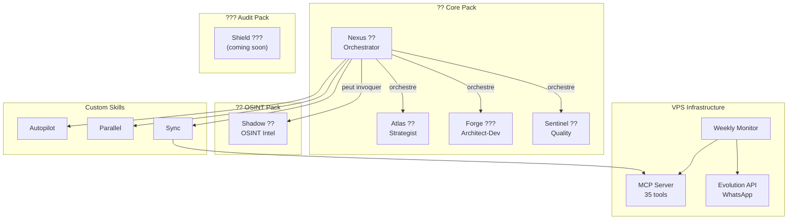

# ?? BMAD+ � Augmented AI-Driven Development Framework

[](../CHANGELOG.md)
[](https://github.com/bmad-code-org/BMAD-METHOD)
[](../LICENSE)

<div align="center">
  <a href="../README.md">English</a> | ?? <b>Fran�ais</b> | <a href="README.es.md">Espa�ol</a> | <a href="README.de.md">Deutsch</a>
</div>

> Fork intelligent de [BMAD-METHOD](https://github.com/bmad-code-org/BMAD-METHOD) v6.2.0 � Agents multi-r�les auto-activables, mode Autopilot, ex�cution parall�le supervis�e, et monitoring upstream WhatsApp.

---

## ?? Table des mati�res

- [Pourquoi BMAD+ ?](#-pourquoi-bmad-)
- [Quick Start](#-quick-start)
- [Architecture](#-architecture)
- [Les 5 Agents](#-les-5-agents)
- [Syst�me de Packs](#-syst�me-de-packs)
- [Innovations](#-innovations)
- [IDE Support�s](#-ide-support�s)
- [Monitoring Upstream](#-monitoring-upstream)
- [Structure du Projet](#-structure-du-projet)
- [Configuration](#-configuration)
- [Version History](#-version-history)
- [Licence](#-licence)

---

## ?? Pourquoi BMAD+ ?

BMAD-METHOD est un framework excellent avec 9 agents sp�cialis�s. Mais pour un d�veloppeur solo ou une petite �quipe, 9 agents c'est trop fragment�. BMAD+ r�sout ce probl�me :

| BMAD-METHOD | BMAD+ |
|---|---|
| 9 agents sp�cialis�s | **5 agents multi-r�les** (11 r�les au total) |
| Activation manuelle uniquement | **Auto-activation intelligente** � 3 niveaux |
| Pas de pipeline automatis� | **Mode Autopilot** : id�e ? livraison |
| Ex�cution s�quentielle | **Parall�lisme supervis�** |
| Pas de suivi upstream | **Monitoring hebdomadaire** avec WhatsApp |
| 1-2 IDE support�s | **5 IDE** avec d�tection automatique |

---

## ? Quick Start

### Installation dans un projet existant

```bash
npx bmad-plus install
```

L'installeur :
1. D�tecte automatiquement les IDE install�s (Claude Code, Gemini CLI, Codex, etc.)
2. Propose les packs � installer (Core, OSINT, Maker, Audit)
3. G�n�re les fichiers de configuration adapt�s
4. Cr�e les dossiers d'artefacts

### Utilisation apr�s installation

#### ?? � qui parler ?

| Tu veux... | Parle � | Exemple |
|---|---|---|
| Discuter d'une id�e de projet | **Atlas** ?? | `Atlas, j'ai une id�e de projet : un SaaS de facturation` |
| Cr�er un PRD / Product Brief | **Atlas** ?? | `Atlas, cr�e le PRD pour mon projet` |
| Concevoir l'architecture technique | **Forge** ??? | `Forge, propose une architecture pour l'app` |
| Impl�menter du code | **Forge** ??? | `Forge, impl�mente la story AUTH-001` |
| �crire la documentation | **Forge** ??? | `Forge, documente l'API` |
| Tester / faire une revue de code | **Sentinel** ?? | `Sentinel, review le module auth` |
| Planifier un sprint | **Nexus** ?? | `Nexus, cr�e les epics et stories pour le MVP` |
| Tout automatiser de A � Z | **Nexus** ?? | `autopilot` puis d�cris ton projet |
| Investiguer une personne (OSINT) | **Shadow** ?? | `Shadow, investigate Jean Dupont` |
| Cr�er un nouvel agent BMAD+ | **Maker** ?? | `Maker, cr�e un agent de support client` |

#### ?? Workflow typique (mode manuel)

```
1. "Atlas, brainstorme sur mon id�e de [projet]"
   ? Atlas analyse, pose des questions, propose des angles

2. "Atlas, cr�e le product brief"
   ? Deliverable: _bmad-output/discovery/product-brief.md

3. "Atlas, r�dige le PRD"
   ? Deliverable: _bmad-output/discovery/prd.md

4. "Forge, propose l'architecture"
   ? Deliverable: _bmad-output/discovery/architecture.md

5. "Nexus, d�coupe en epics et stories"
   ? Deliverable: _bmad-output/build/stories/

6. "Forge, impl�mente la story [X]"
   ? Code g�n�r� + tests

7. "Sentinel, teste et review"
   ? Rapport QA + suggestions
```

#### ? Workflow automatique (mode autopilot)

```
> autopilot
> "Un SaaS de facturation pour PME avec gestion des devis"
```

Nexus orchestre tout automatiquement avec des checkpoints pour ton approbation.

#### ?? Commandes cl�s

| Commande | Description |
|----------|-------------|
| `bmad-help` | Voir tous les agents et skills disponibles |
| `autopilot` | Nexus prend le contr�le du pipeline complet |
| `parallel` | Lancer l'ex�cution multi-agents en parall�le |


#### 🔧 Commandes CLI

| Command | Description |
|---------|-------------|
| `npx bmad-plus install` | Installeur interactif avec sélection de packs et détection IDE |
| `npx bmad-plus scan [chemin]` | Découvrir et indexer les projets dans le cerveau global |
| `npx bmad-plus memory status` | Rapport de santé mémoire (projet + cerveau global) |
| `npx bmad-plus memory export` | Exporter le cerveau en archive Markdown portable |
| `npx bmad-plus doctor` | Vérifier l'intégrité de l'installation |
| `npx bmad-plus update` | Mettre à jour agents et skills (conserve la config) |
| `npx bmad-plus uninstall` | Supprimer BMAD+ du projet actuel |
| `npx bmad-plus autoconfig` | Bootstrap intelligent — auto-détection, installation et configuration |

#### 🔬 Options d'installation avancées

```bash
npx bmad-plus install --packs all --yes
npx bmad-plus install --tools none
npx bmad-plus install --packs core,memory,osint
```

> **💡 Astuce dogfooding :** Utilisez `--tools none` pour installer BMAD+ dans un projet qui a déjà des fichiers de config IDE manuels. Cela installe agents, skills et mémoire sans écraser vos `CLAUDE.md`, `GEMINI.md` ou `AGENTS.md` existants.

#### 🔍 Options de scan

```bash
npx bmad-plus scan D:\DEV
npx bmad-plus scan . --active-days 7 --paused-days 90
npx bmad-plus scan D:\DEV --yes --depth 6
```

> Légende : 🟢 **actif** (modifié < 30 jours), 🟡 **en pause** (30–180 jours), ⚪ **archivé** (> 180 jours). Seuils personnalisables avec `--active-days` et `--paused-days`.

---

## ??? Architecture



---

## ?? Les 5 Agents

### Atlas � Strategist ??

**Fusionne :** Analyst (Mary) + Product Manager (John)

| R�le | Sp�cialit� | Auto-activation |
|------|-----------|-----------------|
| **Analyst** | Recherche march�, SWOT, benchmarks, domain expertise | "analyse", "march�", "benchmark", nouveau projet |
| **Product Manager** | PRD, product briefs, user stories, roadmaps | "PRD", "roadmap", "MVP", phase planning |

**Capabilities :** Brainstorming (BP), Market Research (MR), Domain Research (DR), Technical Research (TR), Product Brief (CB), PRD (PR), UX Design (CU), Document Project (DP)

---

### Forge � Architect-Dev ???

**Fusionne :** Architect (Winston) + Developer (Amelia) + Tech Writer (Paige)

| R�le | Sp�cialit� | Auto-activation |
|------|-----------|-----------------|
| **Architect** | Design technique, API, scalabilit�, choix stack | "architecture", "API", "schema", +5 fichiers modifi�s |
| **Developer** | Impl�mentation TDD, code review, story execution | "implement", "code", "fix", post-architecture |
| **Tech Writer** | Documentation, diagrammes Mermaid, changelogs | "document", "README", post-impl�mentation |

**Capabilities :** Architecture (CA), Implementation Readiness (IR), Dev Story (DS), Code Review (CR), Quick Spec (QS), Quick Dev (QD), Document Project (DP)

**Actions critiques (r�le Dev) :**
- Lire TOUTE la story AVANT impl�mentation
- Ex�cuter les t�ches DANS L'ORDRE
- Tests 100% passants AVANT de passer � la suite
- JAMAIS mentir sur les tests

---

### Sentinel � Quality ??

**Fusionne :** QA Engineer (Quinn) + UX Designer (Sally)

| R�le | Sp�cialit� | Auto-activation |
|------|-----------|-----------------|
| **QA Engineer** | Tests API/E2E, edge cases, coverage, code review | "test", "QA", "bug", post-impl�mentation |
| **UX Reviewer** | Evaluation UX, accessibilit�, interaction design | "UX", "interface", "responsive", changements frontend |

**Capabilities :** QA Tests (QA), Code Review (CR), UX Design (CU)

---

### Nexus � Orchestrator ??

**Fusionne :** Scrum Master (Bob) + Quick-Flow Solo Dev (Barry) + **Autopilot** (nouveau) + **Parallel Supervisor** (nouveau)

| R�le | Sp�cialit� | Auto-activation |
|------|-----------|-----------------|
| **Scrum Master** | Sprint planning, stories, retros, course correction | "sprint", "planning", "backlog" |
| **Quick Flow** | Specs rapides, hotfixes, minimum ceremony | "rapide", "hotfix", "petit fix" |
| **Autopilot** | Pipeline automated idea?delivery avec checkpoints | "autopilot", "g�re tout", mode autopilot |
| **Parallel Supervisor** | Multi-agent concurrent, conflict detection, reallocation | "parall�le", t�ches ind�pendantes d�tect�es |

**Capabilities :** Sprint Planning (SP), Create Story (CS), Epics & Stories (ES), Retrospective (ER), Course Correction (CC), Sprint Status (SS), Quick Spec (QS), Quick Dev (QD), **Autopilot (AP)**, **Parallel (PL)**

---

### Shadow � OSINT Intelligence ?? *(Pack OSINT)*

**Agent d'investigation OSINT complet.**

| Capability | Description |
|-----------|-------------|
| **INV** | Investigation compl�te Phase 0?6 avec dossier scor� |
| **QS** | Quick search multi-moteurs |
| **LI/IG/FB** | Scraping LinkedIn, Instagram, Facebook |
| **PP** | Psychoprofil MBTI / Big Five |
| **CE** | Enrichissement contact (email, t�l�phone) |
| **DG** | Diagnostic des outils/APIs disponibles |

**Stack :** 55+ Apify actors, 7 APIs de recherche, 100% Python stdlib, grades de confiance A/B/C/D

---

### Maker � Agent Creator ?? *(Pack Maker)*

**M�ta-agent qui cr�e d'autres agents.** Donne-lui une description ? il g�n�re un package complet.

| Code | Description |
|------|-------------|
| **CA** | Create Agent � cr�ation guid�e en 4 phases |
| **QA** | Quick Agent � cr�ation rapide avec d�fauts sens�s |
| **EA** | Edit Agent � modifier un SKILL.md existant |
| **VA** | Validate Agent � v�rifier la conformit� BMAD+ |
| **PA** | Package Agent � g�n�rer le dossier d'int�gration |

**Pipeline :** Discovery ? Design (validation user) ? Generation ? Validation
**Output :** `_bmad-output/ready-to-integrate/` � pr�t � copier dans BMAD+

---

## ?? Syst�me de Packs

BMAD+ utilise un syst�me modulaire par packs. Le Core est toujours install�, les packs additionnels sont optionnels.

```
npx bmad-plus install

???  Quels packs installer ?
   Core (Atlas, Forge, Sentinel, Nexus) est toujours inclus.

   ?? OSINT � Shadow (investigation, scraping, psychoprofil)
   ?? Agent Creator � Maker (design, build, package)
   ??? Audit S�curit� � Shield (scan vuln�rabilit�s) [bient�t]
   ?? Tout installer
   Aucun � Core uniquement
```

| Pack | Agents | Skills | Status |
|------|--------|--------|--------|
| ?? **Core** | Atlas, Forge, Sentinel, Nexus | autopilot, parallel, sync | ? Stable |
| ?? **OSINT** | Shadow | bmad-osint-investigate | ? Stable |
| ?? **Maker** | Maker | � | ? Stable |
| ??? **Audit** | Shield | bmad-audit-scan, bmad-audit-report | ?? Coming soon |

Chaque pack d�finit :
- Ses agents et skills
- Ses cl�s API requises/optionnelles
- Son package externe (si applicable)

---

## ? Innovations

### 1. Auto-Activation Intelligente � 3 Niveaux

Chaque agent peut **automatiquement** switcher de r�le quand le contexte le demande :

| Niveau | M�canisme | Exemple |
|--------|-----------|---------|
| ?? **Pattern** | Mots-cl�s dans la demande | "review" ? QA activ� |
| ?? **Contextuel** | Domaine d�tect� pendant le travail | Calculs financiers ? QA auto-activ� apr�s le code |
| ?? **Raisonnement** | Cha�ne logique en cours d'ex�cution | Incoh�rence architecture ? Architect auto-activ� |

L'agent **annonce** ses auto-activations : *"?? I'm switching to QA mode � financial calculations detected. Say 'skip' to stay in current mode."*

Configuration : `src/bmad-plus/data/role-triggers.yaml`

### 2. Mode Autopilot

Donnez une id�e projet ? Nexus orchestre le pipeline complet :

```
?? Discovery (Atlas)
  +? Brainstorming ? Product Brief ? PRD ? UX Design
  ?? CHECKPOINT: Approbation PRD

??? Build (Forge + Sentinel)
  +? Architecture ? Epics ? Stories ? Sprint
  ?? CHECKPOINT: Approbation Architecture
  +? Pour chaque story: Code ? Tests ? (retry si �chec, max 3)
  ?? NOTIFY: Status story

?? Ship (Sentinel + Forge)
  +? Code Review ? UX Review ? Documentation ? Retro
  ?? CHECKPOINT: Approbation finale
```

**Checkpoints configurables :**
- `require_approval` (??) � Pause, notification WhatsApp, attente
- `notify_only` (??) � Notification, continue sauf intervention
- `auto` (??) � Continue automatiquement

### 3. Ex�cution Parall�le Supervis�e

L'Orchestrateur d�tecte les t�ches ind�pendantes et les lance en parall�le :

| Parall�lisable ? | S�quentiel ?? |
|---|---|
| Stories sans d�pendances | M�me fichier modifi� |
| Recherche + audit tech | Story B d�pend de Story A |
| Tests + documentation | Architecture avant code |

**Actions de supervision :** Launch, Monitor, Stop, Restart, Reallocate, Escalate (3 �checs ? notification humaine)

---

## ??? IDE Support�s

L'installeur d�tecte automatiquement les IDE et g�n�re les configs :

| IDE | Fichier Config | D�tection |
|-----|---------------|-----------|
| Claude Code | `CLAUDE.md` | Dossier `.claude/` |
| Gemini CLI | `GEMINI.md` | Dossier `.gemini/` |
| Antigravity | `.gemini/` + `.agents/` | Extension Antigravity |
| Codex CLI | `AGENTS.md` | Dossier `.codex/` |
| OpenCode | `OPENCODE.md` | Config opencode |

---

## ?? Monitoring Upstream

### Pipeline hebdomadaire (cron VPS, lundi 9h)

```
1. git fetch upstream BMAD-METHOD
2. Diff analysis (commits, fichiers modifi�s)
3. Analyse IA via Gemini API ? classification
   ?? Compatible | ?? � v�rifier | ?? Breaking
4. Notification WhatsApp via Evolution API
5. Auto-PR si changements compatibles
```

### Stack
- **weekly-check.py** � Script principal (cron)
- **ai_analyzer.py** � Analyse IA (Gemini 2.0 Flash)
- **notifier.py** � WhatsApp (Evolution API self-hosted) + email fallback
- **mcp_bridge.py** � Pont vers Audit 360� MCP Server (git/github ops)

---

## ?? Structure du Projet

```
BMAD+/
+-- README.md                      ? Ce fichier (Anglais)
+-- readme-international/          ? Traductions en autres langues
+-- CHANGELOG.md                   ? Historique des versions
+-- CLAUDE.md                      ? Config Claude Code
+-- GEMINI.md                      ? Config Gemini CLI
+-- AGENTS.md                      ? Config Codex CLI / OpenCode
+-- .gitignore
�
+-- src/
�   +-- bmad-plus/                 ? MODULE CUSTOM
�       +-- module.yaml            ? Config module + packs
�       +-- module-help.csv        ? Aide contextuelle
�       +-- agents/
�       �   +-- agent-strategist/  ? Atlas (analyst + pm)
�       �   +-- agent-architect-dev/ ? Forge (architect + dev + tw)
�       �   +-- agent-quality/     ? Sentinel (qa + ux)
�       �   +-- agent-orchestrator/ ? Nexus (sm + qf + autopilot + parallel)
�       �   +-- agent-maker/       ? Maker (meta-agent) [pack: maker]
�       �   +-- agent-shadow/      ? Shadow (osint) [pack: osint]
�       +-- skills/
�       �   +-- bmad-plus-autopilot/ ? Pipeline automatis�
�       �   +-- bmad-plus-parallel/  ? Ex�cution parall�le
�       �   +-- bmad-plus-sync/      ? Synchronisation upstream
�       +-- data/
�           +-- role-triggers.yaml ? R�gles auto-activation
�
+-- monitor/                       ?? SURVEILLANCE VPS
�   +-- weekly-check.py            ? Script principal (cron)
�   +-- ai_analyzer.py             ? Analyse IA (Gemini API)
�   +-- notifier.py                ? WhatsApp + email
�   +-- mcp_bridge.py              ? Pont vers MCP Server
�   +-- config.example.yaml        ? Template configuration
�   +-- docker-compose.yml         ? Evolution API
�
+-- mcp-server/                    ??? AUDIT 360� MCP
�   +-- server.py                  ? 35 tools, 7 modules
�   +-- tools/                     ? git_ops, github_ops, etc.
�
+-- osint-agent-package/           ?? OSINT PACKAGE
�   +-- agents/                    ? Agent Shadow (original)
�   +-- skills/                    ? 55+ Apify actors
�   +-- install.ps1                ? Script d'installation
�
+-- upstream/                      ?? R�F�RENCE UPSTREAM
    +-- (clone de BMAD-METHOD)     ? Exclu du repo (.gitignore)
```

---

## ?? Configuration

### Variables du module (`module.yaml`)

| Variable | Description | Valeurs |
|----------|-------------|---------|
| `project_name` | Nom du projet | Auto-d�tect� |
| `user_skill_level` | Niveau du dev | beginner, intermediate, expert |
| `execution_mode` | Mode d'ex�cution | manual, autopilot, hybrid |
| `auto_role_activation` | Auto-switch de r�les | true, false |
| `parallel_execution` | Parall�lisme | true, false |
| `install_packs` | Packs install�s | core, osint, maker, audit, all |

### Cl�s API (selon les packs)

| Cl� | Pack | Usage |
|-----|------|-------|
| `GEMINI_API_KEY` | Monitor | Analyse IA des diffs upstream |
| `EVOLUTION_API_KEY` | Monitor | Notifications WhatsApp |
| `APIFY_API_TOKEN` | OSINT | Scraping r�seaux sociaux |
| `PERPLEXITY_API_KEY` | OSINT | Recherche enrichie |

---

## ?? Version History

| Version | Date | Description |
|---------|------|-------------|
| **0.1.0** | 2026-03-17 | ?? Foundation � 6 agents (Atlas, Forge, Sentinel, Nexus, Shadow, Maker), 3 skills, pack system, monitoring, multi-IDE support |

Voir [CHANGELOG.md](../CHANGELOG.md) pour le d�tail complet.

---

## ?? Licence

MIT � Bas� sur [BMAD-METHOD](https://github.com/bmad-code-org/BMAD-METHOD) (MIT)

### Cr�dits

- **BMAD-METHOD** by [bmad-code-org](https://github.com/bmad-code-org) � Framework de base
- **OSINT Pipeline** bas� sur [smixs/osint-skill](https://github.com/smixs/osint-skill) (MIT)
- **Apify Actor Runner** int�gr� de [apify/agent-skills](https://github.com/apify/agent-skills) (MIT)
