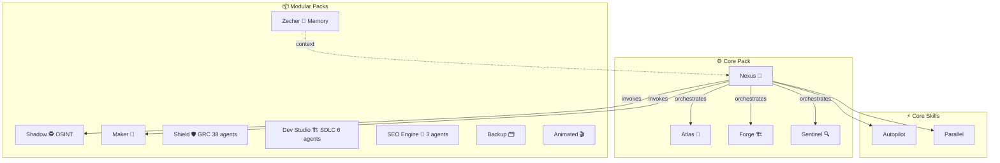

# 🚀 BMAD+ — Framework Multi-Agent IA Augmenté

[](../CHANGELOG.md)
[](https://github.com/bmad-code-org/BMAD-METHOD)
[](../LICENSE)

<div align="center">
  <a href="../README.md">English</a> | 🌐 <b>Français</b> | <a href="README.es.md">Español</a> | <a href="README.de.md">Deutsch</a>
</div>

> **56+ agents multi-rôles · 9 packs modulaires · Mode Autopilot · Exécution parallèle · 143 tests**
> Fork intelligent de [BMAD-METHOD](https://github.com/bmad-code-org/BMAD-METHOD) — Agents auto-activables avec détection contextuelle 3 niveaux, conformité GRC (Shield), pipeline SDLC complet (Dev Studio), intelligence OSINT, audit SEO, mémoire persistante cross-session, et installeur CLI 10 langues.

---

## 📋 Table des matières

- [Pourquoi BMAD+ ?](#-pourquoi-bmad-)
- [Quick Start](#-quick-start)
- [Architecture](#-architecture)
- [Les 56+ Agents](#les-56-agents)
- [Système de Packs](#-système-de-packs)
- [Innovations](#-innovations)
- [IDE Supportés](#-ide-supportés)
- [Monitoring Upstream](#-monitoring-upstream)
- [Structure du Projet](#-structure-du-projet)
- [Configuration](#-configuration)
- [Version History](#-version-history)
- [Licence](#-licence)

---

## 💡 Pourquoi BMAD+ ?

BMAD-METHOD est un excellent framework avec 9 agents spécialisés. Mais pour un développeur solo ou une petite équipe, 9 agents c'est trop fragmenté. BMAD+ résout ce problème :

| BMAD-METHOD | BMAD+ |
|---|---|
| 9 agents spécialisés | **56+ agents** (12 rôles au total) |
| Activation manuelle uniquement | **Auto-activation intelligente** à 3 niveaux |
| Pas de pipeline automatisé | **Mode Autopilot** : idée → livraison |
| Exécution séquentielle | **Parallélisme supervisé** |
| Pas de suivi upstream | **Monitoring hebdomadaire** avec WhatsApp |
| 1-2 IDE supportés | **5 IDE** avec détection automatique |

---

## ⚡ Quick Start

### Installation dans un projet existant

```bash
npx bmad-plus install
```

L'installeur :
1. Détecte automatiquement les IDE installés (Claude Code, Gemini CLI, Codex, etc.)
2. Propose les packs à installer (Core, OSINT, Maker, Audit)
3. Génère les fichiers de configuration adaptés
4. Crée les dossiers d'artefacts

### Utilisation après installation

#### 💬 À qui parler ?

**📊 Stratégie & Découverte**

| Tu veux... | Parle à | Exemple |
|---|---|---|
| Brainstormer une idée de projet | **Atlas** 🎯 | `Atlas, j'ai une idée de projet : un SaaS de facturation` |
| Étude de marché / domaine | **Atlas** 🎯 | `Atlas, analyse le marché des apps de prise de notes IA` |
| Créer un PRD / Product Brief | **Atlas** 🎯 | `Atlas, crée le PRD pour mon projet` |
| Concevoir les wireframes UX | **Atlas** 🎯 | `Atlas, conçois l'UX du flux d'onboarding` |

**🏗️ Architecture & Développement**

| Tu veux... | Parle à | Exemple |
|---|---|---|
| Concevoir l'architecture technique | **Forge** 🏗️ | `Forge, propose une architecture pour l'app` |
| Implémenter une user story | **Forge** 🏗️ | `Forge, implémente la story AUTH-001` |
| Écrire/mettre à jour la doc | **Forge** 🏗️ | `Forge, documente l'API` |
| Hotfix rapide ou petit changement | **Forge** 🏗️ | `Forge, quick dev : ajoute un spinner de chargement` |

**🔍 Qualité & Revue**

| Tu veux... | Parle à | Exemple |
|---|---|---|
| Revue de code | **Sentinel** 🔍 | `Sentinel, review le module auth` |
| Écrire des tests (unit/E2E) | **Sentinel** 🔍 | `Sentinel, écris des tests E2E pour le checkout` |
| Audit UX / accessibilité | **Sentinel** 🔍 | `Sentinel, review l'UX du dashboard` |

**🎼 Gestion de Projet**

| Tu veux... | Parle à | Exemple |
|---|---|---|
| Planifier un sprint | **Nexus** 🎼 | `Nexus, crée les epics et stories pour le MVP` |
| Tout automatiser (A à Z) | **Nexus** 🎼 | `autopilot` puis décris ton projet |
| Lancer des tâches en parallèle | **Nexus** 🎼 | `parallel` — détecte auto les tâches indépendantes |
| Rétrospective de sprint | **Nexus** 🎼 | `Nexus, lance une rétro sur le Sprint 3` |

**🕵️ Intelligence & Packs Spécialisés**

| Tu veux... | Parle à | Exemple |
|---|---|---|
| Investiguer une personne (OSINT) | **Shadow** 🕵️ | `Shadow, investigate Jean Dupont` |
| Créer un nouvel agent BMAD+ | **Maker** 🧬 | `Maker, crée un agent de support client` |
| Rappeler des décisions passées | **Zecher** 🧠 | `Zecher, qu'a-t-on décidé pour la stratégie d'auth ?` |
| Résumé de session (handoff) | **Zecher** 🧠 | `Zecher, crée un handoff pour la prochaine session` |

#### 🚀 Workflow typique (mode manuel)

```
1. "Atlas, brainstorme sur mon idée de [projet]"
   → Atlas analyse, pose des questions, propose des angles

2. "Atlas, crée le product brief"
   → Deliverable: _bmad-output/discovery/product-brief.md

3. "Atlas, rédige le PRD"
   → Deliverable: _bmad-output/discovery/prd.md

4. "Forge, propose l'architecture"
   → Deliverable: _bmad-output/discovery/architecture.md

5. "Nexus, découpe en epics et stories"
   → Deliverable: _bmad-output/build/stories/

6. "Forge, implémente la story [X]"
   → Code généré + tests

7. "Sentinel, teste et review"
   → Rapport QA + suggestions
```

#### ⚡ Workflow automatique (mode autopilot)

```
> autopilot
> "Un SaaS de facturation pour PME avec gestion des devis"
```

Nexus orchestre tout automatiquement avec des checkpoints pour ton approbation.

#### 💬 Commandes clés

| Commande | Description |
|----------|-------------|
| `bmad-help` | Voir tous les agents et skills disponibles |
| `autopilot` | Nexus prend le contrôle du pipeline complet |
| `parallel` | Lancer l'exécution multi-agents en parallèle |


#### 🔧 Commandes CLI

| Commande | Description |
|---------|-------------|
| `npx bmad-plus install` | Installeur interactif avec sélection de packs et détection IDE |
| `npx bmad-plus scan [chemin]` | Découvrir et indexer les projets dans le cerveau global |
| `npx bmad-plus memory status` | Rapport de santé mémoire (projet + cerveau global) |
| `npx bmad-plus memory export` | Export du cerveau en archive Markdown portable |
| `npx bmad-plus doctor` | Vérifier l'intégrité de l'installation |
| `npx bmad-plus update` | Mettre à jour agents et skills (préserve la config) |
| `npx bmad-plus uninstall` | Supprimer BMAD+ du projet actuel |
| `npx bmad-plus autoconfig` | Bootstrap intelligent — détection auto, installation et configuration |

#### 🔬 Options d'installation avancées

```bash
# Installation non-interactive — tous les packs, détection auto des IDE
npx bmad-plus install --packs all --yes

# Installer sans écraser les configs IDE (CLAUDE.md, GEMINI.md, etc.)
npx bmad-plus install --tools none

# Installer des packs spécifiques uniquement
npx bmad-plus install --packs core,memory,osint

# Installer dans un autre répertoire
npx bmad-plus install --directory /chemin/vers/projet
```

> **💡 Astuce dogfooding :** Utilisez `--tools none` quand vous installez BMAD+ dans un projet qui a déjà des configs IDE manuelles. Cela installe agents, skills et mémoire sans écraser vos `CLAUDE.md`, `GEMINI.md` ou `AGENTS.md` existants.

#### 🔍 Options de scan

```bash
# Scanner un disque ou répertoire
npx bmad-plus scan D:\DEV

# Seuils personnalisés pour le statut projet
npx bmad-plus scan . --active-days 7 --paused-days 90

# Auto-indexer tout sans confirmation
npx bmad-plus scan D:\DEV --yes --depth 6
```

> Légende des statuts : 🟢 **actif** (modifié < 30 jours), 🟡 **en pause** (30–180 jours), ⚪ **archivé** (> 180 jours). Seuils personnalisables avec `--active-days` et `--paused-days`.

---

## 🏗️ Architecture



---

## 🎭 Les 56+ Agents

### Atlas — Strategist 🎯

**Fusionne :** Analyst (Mary) + Product Manager (John)

| Rôle | Spécialité | Auto-activation |
|------|-----------|-----------------|
| **Analyst** | Recherche marché, SWOT, benchmarks, domain expertise | "analyse", "marché", "benchmark", nouveau projet |
| **Product Manager** | PRD, product briefs, user stories, roadmaps | "PRD", "roadmap", "MVP", phase planning |

**Capabilities :** Brainstorming (BP), Market Research (MR), Domain Research (DR), Technical Research (TR), Product Brief (CB), PRD (PR), UX Design (CU), Document Project (DP)

---

### Forge — Architect-Dev 🏗️

**Fusionne :** Architect (Winston) + Developer (Amelia) + Tech Writer (Paige)

| Rôle | Spécialité | Auto-activation |
|------|-----------|-----------------|
| **Architect** | Design technique, API, scalabilité, choix stack | "architecture", "API", "schema", +5 fichiers modifiés |
| **Developer** | Implémentation TDD, code review, story execution | "implement", "code", "fix", post-architecture |
| **Tech Writer** | Documentation, diagrammes Mermaid, changelogs | "document", "README", post-implémentation |

**Capabilities :** Architecture (CA), Implementation Readiness (IR), Dev Story (DS), Code Review (CR), Quick Spec (QS), Quick Dev (QD), Document Project (DP)

**Actions critiques (rôle Dev) :**
- Lire TOUTE la story AVANT implémentation
- Exécuter les tâches DANS L'ORDRE
- Tests 100% passants AVANT de passer à la suite
- JAMAIS mentir sur les tests

---

### Sentinel — Quality 🔍

**Fusionne :** QA Engineer (Quinn) + UX Designer (Sally)

| Rôle | Spécialité | Auto-activation |
|------|-----------|-----------------|
| **QA Engineer** | Tests API/E2E, edge cases, coverage, code review | "test", "QA", "bug", post-implémentation |
| **UX Reviewer** | Evaluation UX, accessibilité, interaction design | "UX", "interface", "responsive", changements frontend |

**Capabilities :** QA Tests (QA), Code Review (CR), UX Design (CU)

---

### Nexus — Orchestrator 🎼

**Fusionne :** Scrum Master (Bob) + Quick-Flow Solo Dev (Barry) + **Autopilot** (nouveau) + **Parallel Supervisor** (nouveau)

| Rôle | Spécialité | Auto-activation |
|------|-----------|-----------------|
| **Scrum Master** | Sprint planning, stories, retros, course correction | "sprint", "planning", "backlog" |
| **Quick Flow** | Specs rapides, hotfixes, minimum ceremony | "rapide", "hotfix", "petit fix" |
| **Autopilot** | Pipeline automated idea→delivery avec checkpoints | "autopilot", "gère tout", mode autopilot |
| **Parallel Supervisor** | Multi-agent concurrent, conflict detection, reallocation | "parallèle", tâches indépendantes détectées |

**Capabilities :** Sprint Planning (SP), Create Story (CS), Epics & Stories (ES), Retrospective (ER), Course Correction (CC), Sprint Status (SS), Quick Spec (QS), Quick Dev (QD), **Autopilot (AP)**, **Parallel (PL)**

---

### Shadow — OSINT Intelligence 🔍 *(Pack OSINT)*

**Agent d'investigation OSINT complet.**

| Capability | Description |
|-----------|-------------|
| **INV** | Investigation complète Phase 0→6 avec dossier scoré |
| **QS** | Quick search multi-moteurs |
| **LI/IG/FB** | Scraping LinkedIn, Instagram, Facebook |
| **PP** | Psychoprofil MBTI / Big Five |
| **CE** | Enrichissement contact (email, téléphone) |
| **DG** | Diagnostic des outils/APIs disponibles |

**Stack :** 55+ Apify actors, 7 APIs de recherche, 100% Python stdlib, grades de confiance A/B/C/D

---

### Maker — Agent Creator 🧬 *(Pack Maker)*

**Méta-agent qui crée d'autres agents.** Donne-lui une description → il génère un package complet.

| Code | Description |
|------|-------------|
| **CA** | Create Agent — création guidée en 4 phases |
| **QA** | Quick Agent — création rapide avec défauts sensés |
| **EA** | Edit Agent — modifier un SKILL.md existant |
| **VA** | Validate Agent — vérifier la conformité BMAD+ |
| **PA** | Package Agent — générer le dossier d'intégration |

**Pipeline :** Discovery → Design (validation user) → Generation → Validation
**Output :** `_bmad-output/ready-to-integrate/` — prêt à copier dans BMAD+

---

### Zecher — Gardien de la Mémoire 🧠 *(Pack Memory)*

**Agent de mémoire persistante cross-sessions.** Maintient les connaissances projet entre les conversations.

| Capacité | Description |
|-----------|-------------|
| **Session Handoff** | Crée automatiquement des résumés de session avec décisions, patterns et leçons |
| **Context Recall** | Récupère les décisions/patterns pertinents au début de chaque conversation |
| **Brain Health** | Surveille l'intégrité des fichiers mémoire et détecte l'obsolescence |
| **Cross-Project** | Lie la mémoire projet au cerveau global (`~/.bmad-plus/brain/`) |
| **Karpathy Guardrails** | Empêche les mémoires hallucinées — chaque entrée nécessite une preuve source |

**Fichiers mémoire :** `decisions.md`, `lessons.md`, `patterns.md`, `context.md`, `sessions/`

## 📦 Système de Packs

BMAD+ utilise un système modulaire par packs. Le Core est toujours installé, les packs additionnels sont optionnels.

```
npx bmad-plus install

🎛️  Quels packs installer ?
   Core (Atlas, Forge, Sentinel, Nexus) est toujours inclus.

   🔍 OSINT — Shadow (investigation, scraping, psychoprofil)
   🧬 Agent Creator — Maker (design, build, package)
   🛡️ Audit Sécurité — Shield (scan vulnérabilités)
   🤖 Tout installer
   Aucun — Core uniquement
```

| Pack | Agents | Description | Statut |
|------|--------|-------------|--------|
| ⚙️ **Core** | Atlas, Forge, Sentinel, Nexus | Cycle de vie dev complet : stratégie → architecture → code → QA | ✅ Stable |
| 🔍 **OSINT** | Shadow | Investigation, scraping social, psychoprofil (55+ acteurs Apify) | ✅ Stable |
| 🧬 **Maker** | Maker | Concevoir, construire, valider et packager de nouveaux agents BMAD+ | ✅ Stable |
| 🛡️ **Shield** | 38 agents de conformité | GRC sur 25+ frameworks : GDPR, ISO 27001, SOC 2, HIPAA, PCI DSS, EU AI Act, DORA, NIS2 | ✅ Stable |
| 🏗️ **Dev Studio** | 6 agents spécialisés SDLC | SDLC complet : brainstorm → PRD → architecture → TDD → review (30 workflows) | ✅ Stable |
| 🔍 **SEO** | Scout, Chief, Judge | Audit SEO 6 phases, boucle PageSpeed, APIs Google, benchmark concurrentiel | ✅ Stable |
| 🗂️ **Backup** | Backup Agent | ZIP horodaté avec exclusions intelligentes | ✅ Stable |
| 🎬 **Animated** | Animated Website Agent | Site web luxe scroll-driven à partir de vidéo | ✅ Stable |
| 🧠 **Memory** | Zecher | Cerveau cross-session, scanner de projets, guardrails Karpathy | ✅ Stable |

Chaque pack définit :
- Ses agents, skills et workflows
- Ses clés API requises/optionnelles
- Son package externe (si applicable)
- Ses règles de cohabitation avec les autres packs

---

## ✨ Innovations

### 1. Auto-Activation Intelligente à 3 Niveaux

Chaque agent peut **automatiquement** switcher de rôle quand le contexte le demande :

| Niveau | Mécanisme | Exemple |
|--------|-----------|---------|
| 🔤 **Pattern** | Mots-clés dans la demande | "review" → QA activé |
| 🌐 **Contextuel** | Domaine détecté pendant le travail | Calculs financiers → QA auto-activé après le code |
| 🧠 **Raisonnement** | Chaîne logique en cours d'exécution | Incohérence architecture → Architect auto-activé |

L'agent **annonce** ses auto-activations : *"💡 I'm switching to QA mode — financial calculations detected. Say 'skip' to stay in current mode."*

Configuration : `src/bmad-plus/data/role-triggers.yaml`

### 2. Mode Autopilot

Donnez une idée projet → Nexus orchestre le pipeline complet :

```
📋 Discovery (Atlas)
  └→ Brainstorming → Product Brief → PRD → UX Design
  🔴 CHECKPOINT: Approbation PRD

🏗️ Build (Forge + Sentinel)
  └→ Architecture → Epics → Stories → Sprint
  🔴 CHECKPOINT: Approbation Architecture
  └→ Pour chaque story: Code → Tests → (retry si échec, max 3)
  🟡 NOTIFY: Status story

🚀 Ship (Sentinel + Forge)
  └→ Code Review → UX Review → Documentation → Retro
  🔴 CHECKPOINT: Approbation finale
```

**Checkpoints configurables :**
- `require_approval` (🔴) — Pause, notification WhatsApp, attente
- `notify_only` (🟡) — Notification, continue sauf intervention
- `auto` (🟢) — Continue automatiquement

### 3. Exécution Parallèle Supervisée

L'Orchestrateur détecte les tâches indépendantes et les lance en parallèle :

| Parallélisable ✅ | Séquentiel 🚫 |
|---|---|
| Stories sans dépendances | Même fichier modifié |
| Recherche + audit tech | Story B dépend de Story A |
| Tests + documentation | Architecture avant code |

**Actions de supervision :** Launch, Monitor, Stop, Restart, Reallocate, Escalate (3 échecs → notification humaine)

---

## 🖥️ IDE Supportés

L'installeur détecte automatiquement les IDE et génère les configs :

| IDE | Fichier Config | Détection |
|-----|---------------|-----------|
| Claude Code | `CLAUDE.md` | Dossier `.claude/` |
| Gemini CLI | `GEMINI.md` | Dossier `.gemini/` |
| Antigravity | `.gemini/` + `.agents/` | Extension Antigravity |
| Codex CLI | `AGENTS.md` | Dossier `.codex/` |
| OpenCode | `OPENCODE.md` | Config opencode |

---

## 📡 Monitoring Upstream

### Pipeline hebdomadaire (cron VPS, lundi 9h)

```
1. git fetch upstream BMAD-METHOD
2. Diff analysis (commits, fichiers modifiés)
3. Analyse IA via Gemini API → classification
   🟢 Compatible | 🟡 À vérifier | 🔴 Breaking
4. Notification WhatsApp via Evolution API
5. Auto-PR si changements compatibles
```

### Stack
- **weekly-check.py** — Script principal (cron)
- **ai_analyzer.py** — Analyse IA (Gemini 2.0 Flash)
- **notifier.py** — WhatsApp (Evolution API self-hosted) + email fallback
- **mcp_bridge.py** — Pont vers Audit 360° MCP Server (git/github ops)

---

## 📁 Structure du Projet

```
BMAD+/
├── README.md                      ← Ce fichier (Anglais)
├── readme-international/          ← Traductions en autres langues
├── CHANGELOG.md                   ← Historique des versions
├── CLAUDE.md                      ← Config Claude Code
├── GEMINI.md                      ← Config Gemini CLI
├── AGENTS.md                      ← Config Codex CLI / OpenCode
├── .gitignore
│
├── src/
│   └── bmad-plus/                 ⭐ MODULE CUSTOM
│       ├── module.yaml            ← Config module + packs
│       ├── module-help.csv        ← Aide contextuelle
│       ├── agents/
│       │   ├── agent-strategist/  ← Atlas (analyst + pm)
│       │   ├── agent-architect-dev/ ← Forge (architect + dev + tw)
│       │   ├── agent-quality/     ← Sentinel (qa + ux)
│       │   ├── agent-orchestrator/ ← Nexus (sm + qf + autopilot + parallel)
│       │   ├── agent-maker/       ← Maker (meta-agent) [pack: maker]
│       │   └── agent-shadow/      ← Shadow (osint) [pack: osint]
│       ├── skills/
│       │   ├── bmad-plus-autopilot/ ← Pipeline automatisé
│       │   ├── bmad-plus-parallel/  ← Exécution parallèle
│       │   └── bmad-plus-sync/      ← Synchronisation upstream
│       └── data/
│           └── role-triggers.yaml ← Règles auto-activation
│
├── monitor/                       🤖 SURVEILLANCE VPS
│   ├── weekly-check.py            ← Script principal (cron)
│   ├── ai_analyzer.py             ← Analyse IA (Gemini API)
│   ├── notifier.py                ← WhatsApp + email
│   ├── mcp_bridge.py              ← Pont vers MCP Server
│   ├── config.example.yaml        ← Template configuration
│   └── docker-compose.yml         ← Evolution API
│
├── mcp-server/                    🛡️ AUDIT 360° MCP
│   ├── server.py                  ← 35 tools, 7 modules
│   └── tools/                     ← git_ops, github_ops, etc.
│
├── osint-agent-package/           🔍 OSINT PACKAGE
│   ├── agents/                    ← Agent Shadow (original)
│   ├── skills/                    ← 55+ Apify actors
│   └── install.ps1                ← Script d'installation
│
└── upstream/                      📦 RÉFÉRENCE UPSTREAM
    └── (clone de BMAD-METHOD)     ← Exclu du repo (.gitignore)
```

---

## ⚙️ Configuration

### Variables du module (`module.yaml`)

| Variable | Description | Valeurs |
|----------|-------------|---------|
| `project_name` | Nom du projet | Auto-détecté |
| `user_skill_level` | Niveau du dev | beginner, intermediate, expert |
| `execution_mode` | Mode d'exécution | manual, autopilot, hybrid |
| `auto_role_activation` | Auto-switch de rôles | true, false |
| `parallel_execution` | Parallélisme | true, false |
| `install_packs` | Packs installés | core, osint, maker, audit, all |

### Clés API (selon les packs)

| Clé | Pack | Usage |
|-----|------|-------|
| `GEMINI_API_KEY` | Monitor | Analyse IA des diffs upstream |
| `EVOLUTION_API_KEY` | Monitor | Notifications WhatsApp |
| `APIFY_API_TOKEN` | OSINT | Scraping réseaux sociaux |
| `PERPLEXITY_API_KEY` | OSINT | Recherche enrichie |

---

## 📜 Version History

| Version | Date | Description |
|---------|------|-------------|
| **0.1.0** | 2026-03-17 | 🎉 Foundation — 56+ agents (Atlas, Forge, Sentinel, Nexus, Shadow, Maker), 3 skills, pack system, monitoring, multi-IDE support |
| **0.2.0** | 2026-03-18 | 🔀 Fusion Oveanet — 3 nouveaux packs utilitaires : SEO Audit 360, Universal Backup, Animated Website |
| **0.3.0** | 2026-03-19 | 🚀 SEO Engine v2.0 — 3 agents multi-rôles, 4 scripts Python, workflow 6 phases, boucle PageSpeed, analyse GEO |
| **0.4.0** | 2026-03-19 | 🏢 SEO Engine v2.1 — Orchestrateur SKILL.md, APIs Google, rapports HTML, benchmark concurrentiel, 50 tests, extensions GSC + GA4 |
| **0.4.1** | 2026-03-19 | 🌐 CLI 10 langues, pipeline CI/CD, `.npmignore`, durcissement sécurité |
| **0.4.2** | 2026-03-19 | 📦 Packs publics — SEO/Backup/Animated dans npm |
| **0.4.3** | 2026-05-17 | 🔧 Commandes update + doctor, i18n complète, correction crédits |
| **0.4.4** | 2026-05-17 | 🔧 Correction encodage UTF-8, i18n complète 10 langues, 62 tests unitaires |
| **0.5.0** | 2026-05-17 | 🛡️ **Pack Shield** — 38 agents de conformité GRC |
| **0.6.0** | 2026-05-17 | 🏗️ **Pack Dev Studio** — 6 agents spécialisés SDLC + 30 workflows SDLC |
| **0.9.0** | 2026-06-24 | 🚀 **Augmenté & Sécurisé** — 3 nouveaux packs (animated, backup, seo), correction P0 sécurité, 143/143 tests |
| **0.8.0** | 2026-06-24 | 🚀 **Augmenté & Sécurisé** — 3 nouveaux packs (animated, backup, seo), correction P0 sécurité, 143/143 tests |

Voir [CHANGELOG.md](../CHANGELOG.md) pour le détail complet.

---

## 📄 Licence

MIT — Basé sur [BMAD-METHOD](https://github.com/bmad-code-org/BMAD-METHOD) (MIT)

### Crédits

**Créateur**
- **BMAD+** Créé par [Laurent Rochetta](https://github.com/lrochetta) ([LinkedIn](https://www.linkedin.com/in/laurentrochetta/))

**Packs Originaux** (créés par Laurent Rochetta)
- **Dev Studio** — 6 agents SDLC spécialisés : Miriam (analyste d'affaires), Huldah (rédactrice technique), Yosef (chef de produit), Rachel (designer UX), Bezalel (architecte système), Oholiab (ingénieur senior) — 44 workflows couvrant l'ensemble du cycle de vie du brainstorming au déploiement
- **SEO Engine** — 3 agents (Scout, Chief, Judge), pipeline d'audit 6 phases, boucle PageSpeed, intégrations Google Search Console et GA4
- **Memory Pack** — Agent Zecher pour cerveau persistant cross-session avec scanner de projets

**Sources Externes et Inspirations**
- **BMAD-METHOD** par [bmad-code-org](https://github.com/bmad-code-org/BMAD-METHOD) — Méthodologie multi-agents originale (MIT)
- **Shield GRC** — 38 agents de conformité basés sur des textes réglementaires publics (RGPD, ISO 27001, SOC 2, HIPAA, EU AI Act, DORA, NIST, CMMC, etc.)
- **OSINT Pipeline** basé sur [smixs/osint-skill](https://github.com/smixs/osint-skill) (MIT)
- **Apify Actor Runner** intégré de [apify/agent-skills](https://github.com/apify/agent-skills) (MIT)
- **Karpathy Guardrails** adapté de [Andrej Karpathy](https://github.com/multica-ai/andrej-karpathy-skills) (MIT) — Règles comportementales pour Memory Pack

**Outils et Infrastructure**
- [Evolution API](https://github.com/EvolutionAPI/evolution-api) — Notifications WhatsApp pour la surveillance upstream
- [Gemini API](https://ai.google.dev/) — Analyse IA pour la classification des changements upstream
